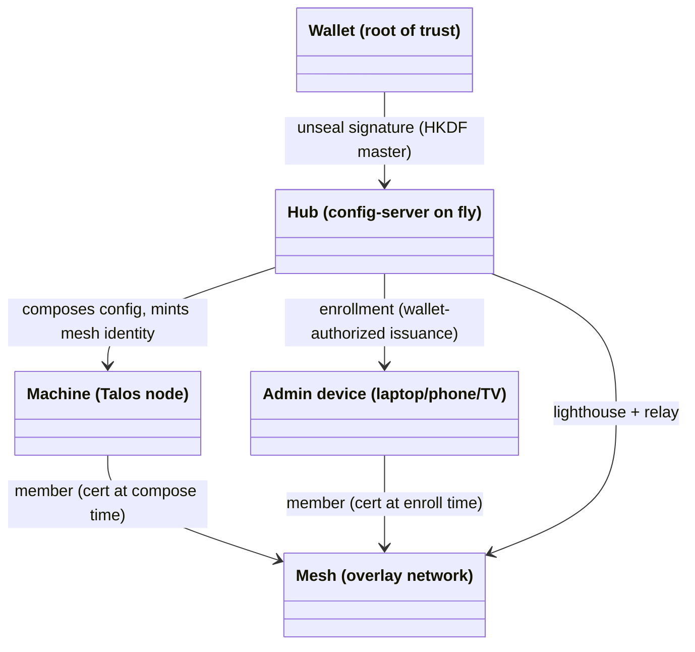

# Domain Model

<!-- High-level entities and how they relate. Conceptual, not an ERD —
     no attributes, no cardinality, no FKs. Just nouns and relationships.
     Use Mermaid. Add a short glossary if terms are non-obvious. -->

## Glossary

- **Identity** — *who is the owner/admin*: wallet address, proven by
  offline EIP-191 signature recovery. Stateless by construction.
- **Membership** — *which devices are in the mesh*: a pure function of
  (git, wallet); with nebula, membership = holding a cert signed by
  the wallet-derived CA. Distinct from identity; both must be
  stateless (invariant 1).
- **Hub** — the single config-server binary on fly.io: config
  composition, device-flow auth, KMS, enrollment, mesh
  lighthouse/relay. Trusted infrastructure, not a root of trust.
- **Unseal** — the wallet signature over the frozen master message
  that (re)creates the hub's HKDF master after each deploy. While
  sealed, derived roles are down; nothing is lost.
- **Enrollment** — wallet-authorized issuance of a device's mesh
  identity from an admin device (`wgup`/`nebup` pattern); the wallet
  never touches the enrolled device.
