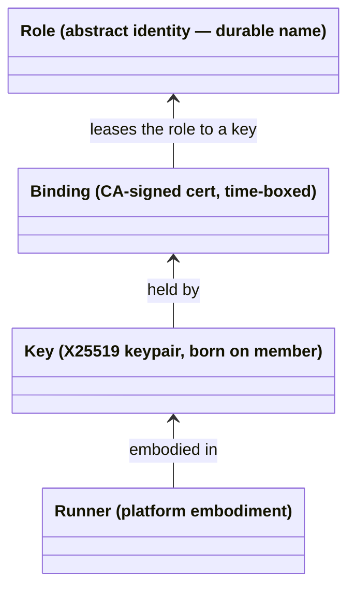
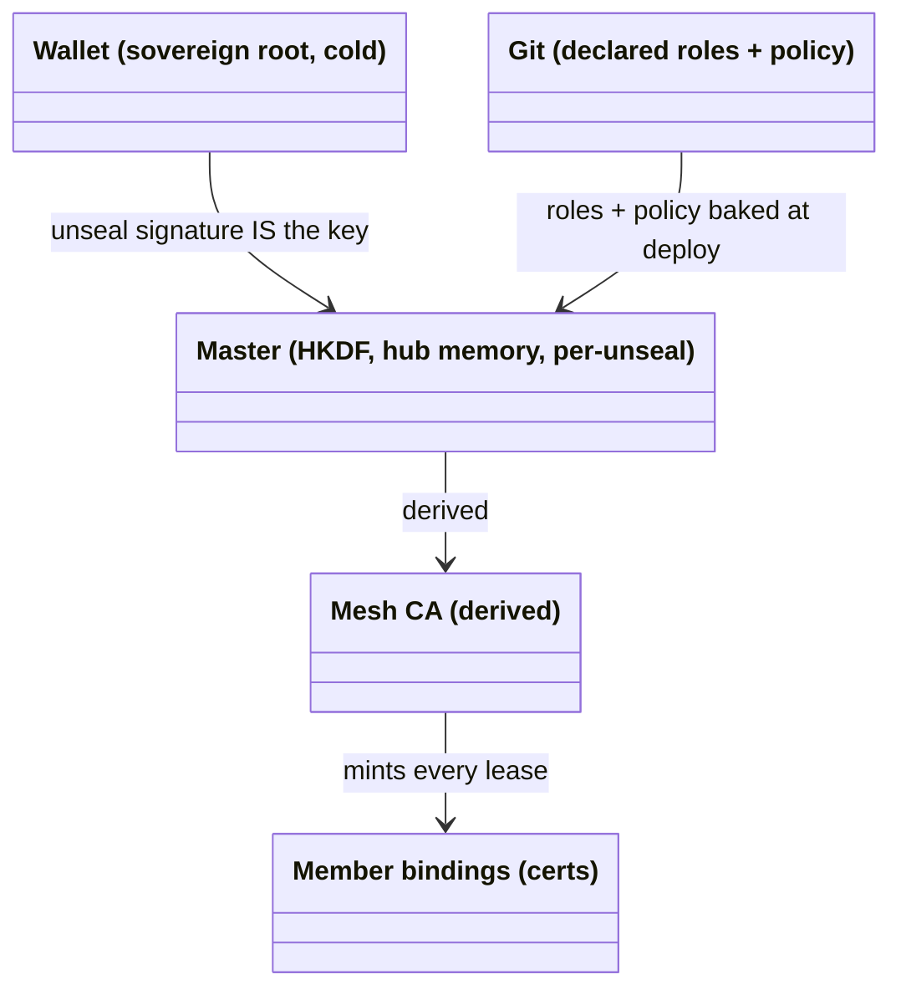
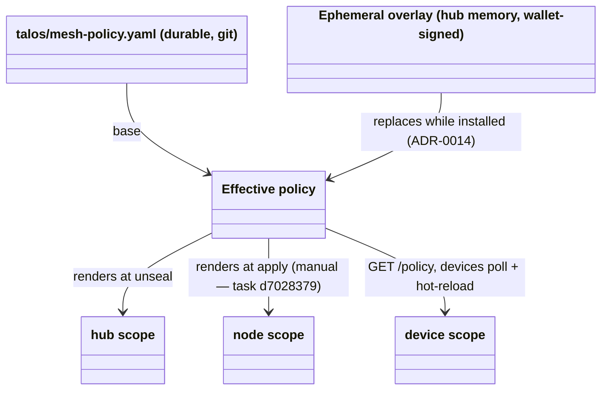
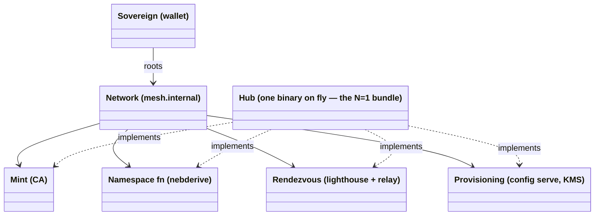
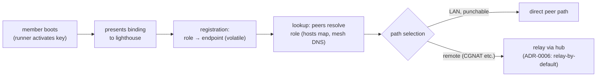

# Domain Model

<!-- High-level entities and how they relate. Conceptual, not an ERD —
     no attributes, no cardinality, no FKs. Nouns and relationships,
     Mermaid diagrams, glossary. Exempt from the desired-state line
     budget: as expressive as the domain requires; pruned for
     accuracy and drift, never for length. -->

What this system models, in one sentence: **decentralized,
client-owned identity under wallet-rooted authority, organized into
networks a sovereign offers and members consent to, with peer-to-peer
data paths and per-network central services.** Four concepts carry
everything: the member stack (§1), authority (§2), the network (§3),
and rendezvous (§4).

The model is written for N networks and N sovereigns; the current
deployment is the **N=1 instance** — one sovereign (the wallet), one
network (`mesh.internal`), one node (the hub) providing all of the
network's services.

## 1. The member stack: role ← binding ← key ← runner

Every member is four layers, each independently replaceable:

- **Role** — a durable name in a sovereign's namespace: `cp1`, `tv`,
  `marius-laptop`. **Roles never act**; they are what action is
  attributed to. The role owns the address, the DNS labels, and the
  policy predicates that match it. Roles come into being two ways:
  *declared* in git (`talos/machines/<mac>/` — the MAC selects which
  config a box receives, invariant 6) or *ratified* at enrollment
  (the approver-set device name). Addresses derive from the role by
  pure function — `MachineIP(master, MAC)`, `DeviceIP(master, name)`
  — so the namespace is a **stateless registry**: computed, never
  stored, impossible to drift (invariants 1–2).
- **Binding** — the CA-signed cert: a time-boxed lease of a role to a
  key, carrying (name, address, groups), 90-day validity. Membership
  *is* holding an unexpired binding; **revocation is expiry**
  (blocklist-by-fingerprint as the emergency path). Re-keying mints a
  new lease on the same role — nothing moves.
- **Key** — the only thing that acts. Born on the member, never
  travels; the hub mints bindings, never keys (ADR-0012 for devices;
  ADR-0015, Proposed, extends this to machines — until it lands,
  machine keys are still hub-derived via `nebderive.MachineKey`).
  Keys are disposable: identity death at the leaves is normal
  operation; the role is what survives.
- **Runner** — the platform adapter the key lives in: `ext-nebula`
  (Talos allows no agents), the Android app (no root: gomobile +
  VpnService fd + split-DNS shim), `nebup` (stock binary on a
  laptop). All wrap one shared core (`nebderive`, `devkey`,
  enrollment, `policyclient`); convergence owed (task `ea9404af`).

Replaceability is the point: re-key and the role stays; reinstall and
the role stays; swap runner and both stay. A NIC swap changes which
*config* a box selects — a role change, correctly requiring fresh
ratification — not a key event.

## 2. Authority: one sovereign, delegation depth two

Everything reduces to two owner-held keys; servers hold no durable
authority of their own (invariants 1–3).

Authority has exactly two tiers, both rooted at the wallet:

- **Admission** — may this key hold this role: every admission is
  **exactly one wallet signature**, verified by one mint core. Entry
  adapters differ only in the signature's *distance* from the
  enrollment act:

  | Adapter | Signature distance |
  |---|---|
  | nebup | **zero** — signer operates the enrolling device |
  | RFC 8628 / APK | **spatial** — device proposes, approver signs elsewhere |
  | machine boot token (ADR-0015) | **temporal** — the hardware-approval signature, carried forward by a single-use token in the served config |

- **Authorization** — what may this role reach: policy predicates
  (`host:`, `group:`) over binding attributes, enforced at handshake
  and firewall — checked once per connection, not per message.

### Policy: payload, not identity

Policy names members by role predicates, so syncing rules never moves
bindings, keys or addresses. The three scopes are member *classes* in
the admission table, not kinds of member. Propagation is the
remaining asymmetry: devices self-update (phase 3), nodes need an
`apply` until phase 4 lands (`d7028379`).

## 3. Network: a sovereign's offer, a member's consent

A **network** is the bundle a sovereign roots: a namespace (the
role-set and its derivation function), an admission policy, and
rendezvous services. Hierarchy is not a property of the system —
it is something a sovereign *offers* and members *consent to* by
obtaining bindings. A key could hold bindings in several networks;
sovereigns are many in the model, one in this deployment.

The four services are conceptually separable even though one binary
implements all four — that separation is what keeps the N>1
generalization legible. The hub centralizes **authority-minting and
rendezvous, never traffic** (§4). It is trusted infrastructure, not a
root of trust (invariant 3): killable and fully re-derivable from
(git, wallet) with one unseal. Everything runtime on it is either a
delegation-in-flight or re-derivable; ephemeral state (sessions,
pending enrollments, the policy overlay) dies with the process by
design.

## 4. Rendezvous: registration, lookup, path selection

Discovery holds the system's **only genuinely runtime state**
(role → current endpoint), and that state is volatile by design.

- **Registration** — a member's first act on any network: present the
  binding to the network's lighthouse(s). Nebula's lighthouse
  protocol keeps the mapping fresh internally (location updates ride
  regular traffic — piggybacking for free); the hub never persists it.
- **Lookup** — roles resolve through the mesh zone
  (`*.mesh.internal`): declared roles (machines, hub) always resolve
  from the derived namespace; device roles resolve only while their
  tunnel is live (live-peers-only, ADR-0012); any name scoped under a
  member (`jellyfin.cp1.…`) resolves to that member.
- **Path selection** — the data plane is **peer-to-peer**: direct
  paths on the LAN (a stated goal — LAN traffic never hairpins
  through fly), relay through the hub for remote members, because
  ordinary remote networks are symmetric NATs nothing can punch
  (ADR-0006). The relay forwards envelopes; it is fallback, not
  middleman.

Rendezvous is post-bootstrap by invariant 4: nothing on the
provisioning or recovery path may depend on it.

## Glossary

- **Sovereign / Owner** — the root identity: wallet address
  `0xf568…9406`, proven by offline EIP-191 signature recovery.
  Stateless by construction. (Formerly glossed as "Identity";
  renamed to free the word.)
- **Role** — abstract identity: a durable name in a network's
  namespace. Owns address, DNS labels, policy predicates. Never acts.
- **Binding** — a CA-signed cert leasing a role to a key for a
  bounded time (90 days). Holding one *is* membership.
- **Key** — concrete identity: X25519 keypair born on the member,
  never travels. The only thing that acts.
- **Runner** — the platform embodiment of a key: ext-nebula, Android
  app, nebup.
- **Signature distance** — where/when the admission signature is
  produced relative to the enrollment act: zero (nebup), spatial
  (approver flow), temporal (machine boot token).
- **Network** — a sovereign-rooted bundle: namespace + admission
  policy + rendezvous services. This deployment runs one.
- **Hub** — the single config-server binary on fly.io implementing
  the network's four services (mint, namespace, rendezvous,
  provisioning) plus the `/status` and `/policy` admin pages.
  Trusted infrastructure, not a root of trust; killable and
  re-derivable (one unseal).
- **Unseal** — the wallet signature over the frozen master message
  that (re)creates the hub's HKDF master after each deploy. While
  sealed, derived roles are down; nothing is lost.
- **Enrollment** — wallet-authorized minting of a binding: the member
  submits its own pubkey, the approver (at whatever signature
  distance) ratifies role + group, one signature mints the cert.
- **Group** — the authorization unit signed into a binding
  (`admins`, `media`, `machines`); what policy rules and per-route
  HTTP gates match on.
- **Mesh zone** — `*.mesh.internal`, served by the hub: declared
  roles from the derived namespace, device roles while their tunnel
  is live.
- **KMS / disk encryption** — node STATE/EPHEMERAL keys derive from
  the master per (machine, partition); unlock rides WAN HTTPS, never
  the overlay (invariant 4).
- **Workload plane** — Kubernetes on the machines: ArgoCD syncs
  `k8s/` from git; ingress-nginx routes `<svc>.cp1.mesh.internal` on
  :80; SIWE→OIDC bridge gates every exposed service with the wallet.
  Data-plane state is excepted from invariant 2 (Longhorn bookkeeping
  shares its payload's fate).

## Relation to the sovereign-actor sketch

The model deliberately mirrors
[`../sovereign-actor-protocol.md`](../sovereign-actor-protocol.md)
where the shapes agree — client-born keys, revocation-as-expiry,
lighthouse rendezvous, consensual hierarchy — and diverges knowingly
where it doesn't: this system *embraces* the stable-name registry SAP
refuses (made safe by being stateless), checks authority once per
connection rather than per message, and has no economics. Members own
their keys, not their authority: a single-sovereign instance of the
SAP trust topology.
