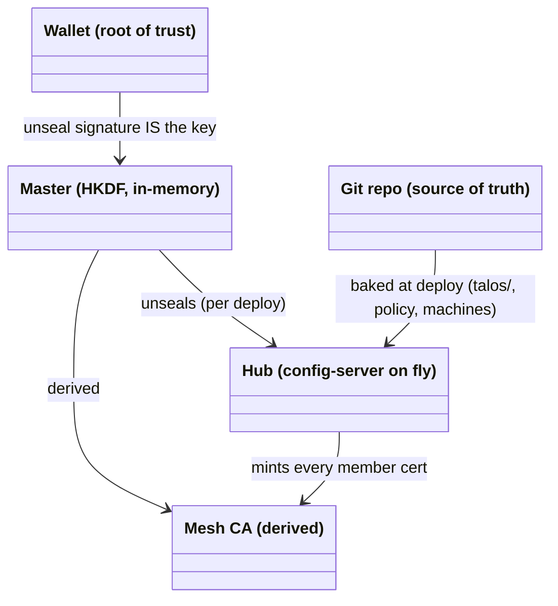
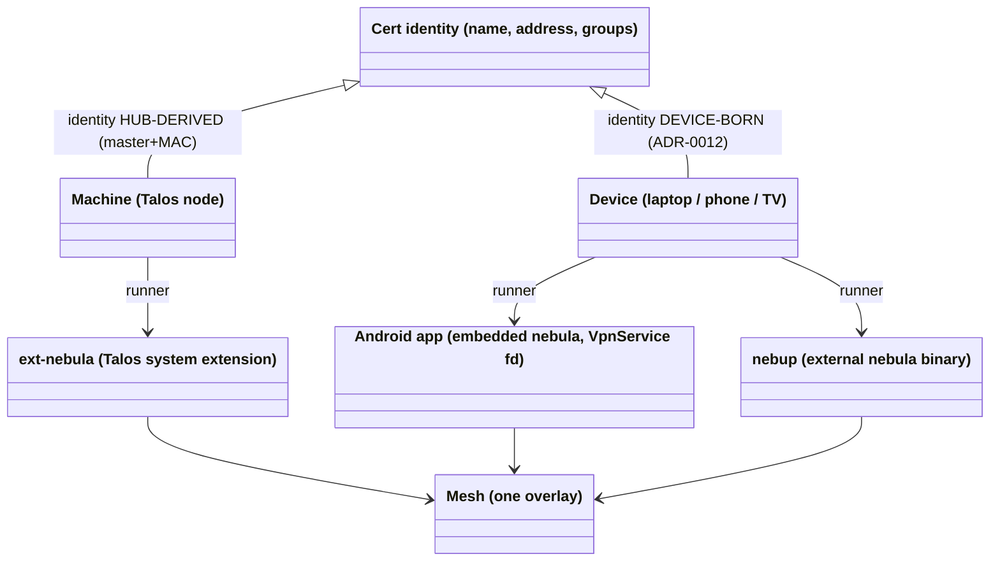
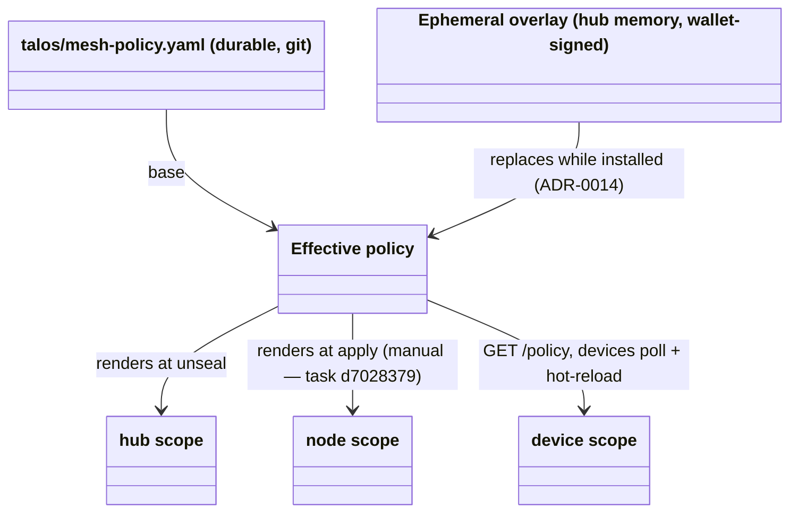

# Domain Model

<!-- High-level entities and how they relate. Conceptual, not an ERD —
     no attributes, no cardinality, no FKs. Just nouns and relationships.
     Use Mermaid. Add a short glossary if terms are non-obvious. -->

## Trust and derivation

Everything derives from two owner-held keys; servers hold no durable
state of their own (invariants 1–3).

## Members: one concept, two identity lifecycles, three runners

On the mesh there is exactly **one member concept**: a cert identity —
X25519 keypair + CA-signed cert carrying (name, address, groups). The
hub, every node and every device are uniform networking targets: same
derivation tree, same DNS zone, same policy vocabulary. What differs
is deliberate or platform-bound, not conceptual:

- **Identity lifecycle is a trust-model split, not clutter.** Machine
  identity must be recomputable from (git, master) so a wiped node
  rebuilds from nothing (invariants 1–2). Device keys must be born
  on-device and never travel, so the device set is *not* enumerable
  from git — membership is a wallet signature, 90-day certs.
- **Runners are platform adapters** around a shared core (`nebderive`,
  `devkey`, enrollment flow, `policyclient`): Talos allows no agents
  (extension + apid), Android allows no root (gomobile + tun fd +
  split-DNS shim), a laptop runs the stock binary. Convergence owed:
  nebup embedding nebula (task `ea9404af`).

## Policy: payload, not identity

Policy names members by cert predicates (`host:` name, `group:`), so
syncing rules never moves certs, keys or addresses. The three scopes
are member *classes* in the admission table, not three kinds of
member. Propagation is the remaining asymmetry: devices self-update
(phase 3), nodes need an `apply` until phase 4 lands (`d7028379`).

## Glossary

- **Identity** — *who is the owner/admin*: wallet address, proven by
  offline EIP-191 signature recovery. Stateless by construction.
- **Membership** — *which parties are on the mesh*: holding a cert
  signed by the wallet-derived CA. For machines, recomputable from
  git; for devices, bounded by wallet-signed enrollment acts.
- **Hub** — the single config-server binary on fly.io: config
  composition, device-flow auth, KMS, enrollment, mesh
  lighthouse/relay, mesh HTTP (`/config` `/hosts` `/policy`), the
  `/status` and `/policy` admin pages. Trusted infrastructure, not a
  root of trust; killable and re-derivable (one unseal).
- **Unseal** — the wallet signature over the frozen master message
  that (re)creates the hub's HKDF master after each deploy. While
  sealed, derived roles are down; nothing is lost. Ephemeral state
  (sessions, pending enrollments, the policy overlay) dies with the
  process by design.
- **Enrollment** — wallet-authorized issuance of a device cert: the
  device submits its own pubkey (RFC 8628 QR flow or nebup direct),
  the approver ratifies name + group, one signature mints the cert.
- **Group** — the authorization unit signed into a cert at enrollment
  (`admins`, `media`, `machines`); what policy rules and per-route
  HTTP gates match on.
- **Mesh zone** — `*.mesh.internal`, served by the hub: machines from
  the derived zone, devices while their tunnel is live, any name
  scoped under a member (`jellyfin.cp1.…`) resolving to that member.
- **KMS / disk encryption** — node STATE/EPHEMERAL keys derive from
  the master per (machine, partition); unlock rides WAN HTTPS, never
  the overlay (invariant 4).
- **Workload plane** — Kubernetes on the machines: ArgoCD syncs
  `k8s/` from git; ingress-nginx routes `<svc>.cp1.mesh.internal` on
  :80; SIWE→OIDC bridge (siwe-oidc + oauth2-proxy / native OIDC)
  gates every exposed service with the wallet. Data-plane state is
  excepted from invariant 2 (Longhorn bookkeeping shares its
  payload's fate).
