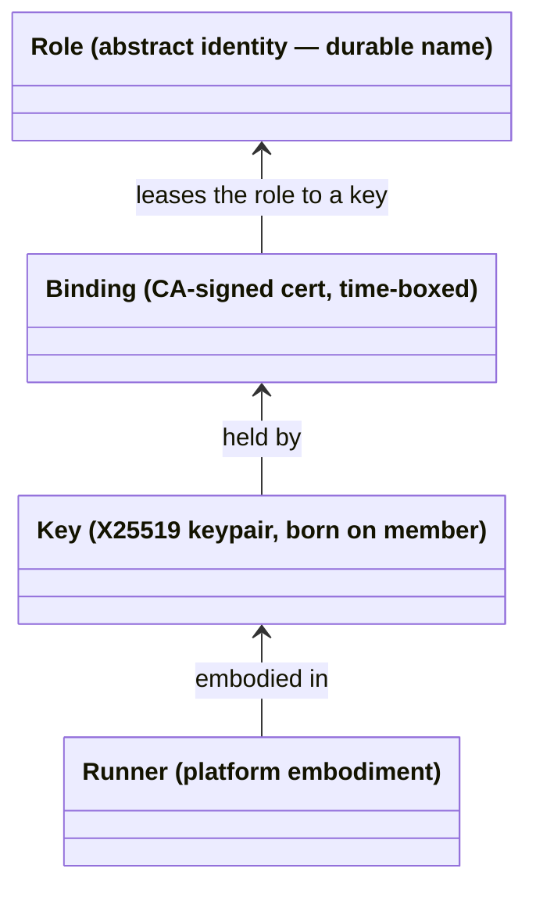
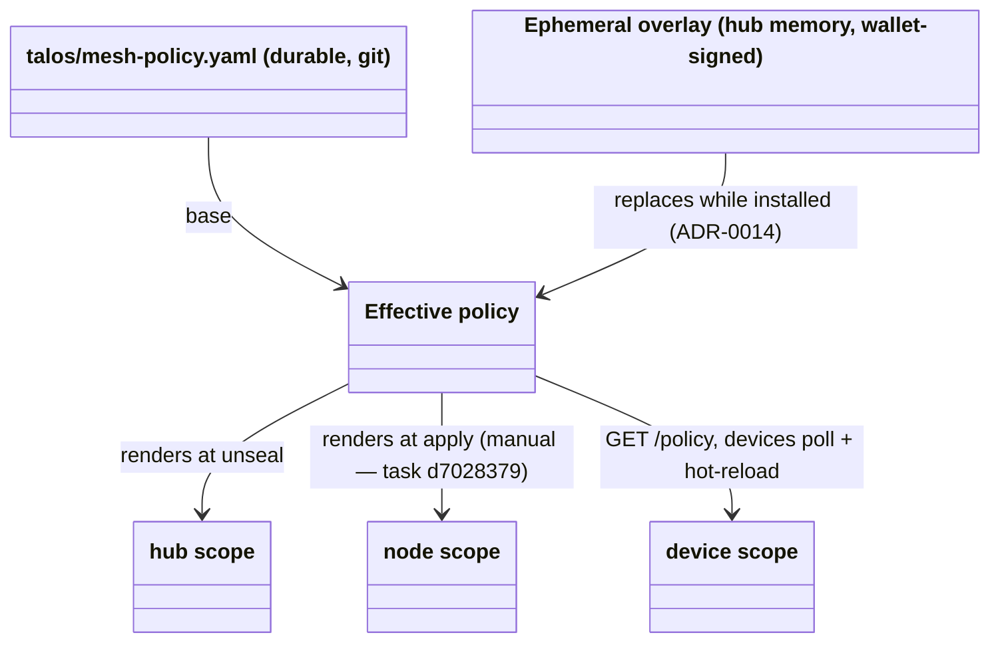
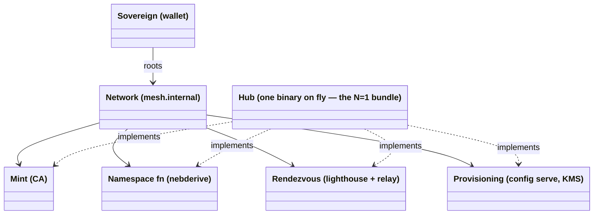
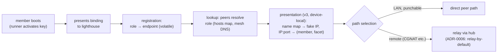

# Domain Model

<!-- High-level entities and how they relate. Conceptual, not an ERD —
     no attributes, no cardinality, no FKs. Nouns and relationships,
     Mermaid diagrams, glossary. Exempt from the desired-state line
     budget: as expressive as the domain requires; pruned for
     accuracy and drift, never for length. -->

> **Live vs. planned (2026-09-03).** This model is written for the
> *desired* state and is deliberately ahead of the code. What runs
> today: nebula mesh, CA-signed bindings, receiver-side firewall
> compiled from `mesh-policy.yaml` (ADR-0014), SIWE→OIDC app sessions
> (ADR-0010). **Planned, not built:** everything marked ADR-0016 /
> ADR-0017 or `359.*` — iroh transport, grants, facets, consent
> grants, `authorize()`, the name map. The §1–§4 structure and the
> "three layers" vocabulary apply to both; the glossary says per term
> which side it is on.

What this system models, in one sentence: **decentralized,
client-owned identity under wallet-rooted authority, organized into
networks a sovereign offers and members consent to, with peer-to-peer
data paths and per-network central services.** Four concepts carry
everything: the member stack (§1), authority (§2), the network (§3),
and rendezvous (§4).

The model is written for N networks and N sovereigns; the current
deployment is the **N=1 instance** — one sovereign (the wallet), one
network (`mesh.internal`), one node (the hub) providing all of the
network's services.

### The three layers (read this before the sections)

Pinned 2026-09-03 after a design session that lost time to loose
terms. Everything below sits in one of three layers; keep them apart.

| Layer | What it is | Where in this doc |
|---|---|---|
| **Actor** | the universal unit: has a key, has a wallet, is reachable by knowing only its public key, can send to any other actor. No hierarchy at this layer. Owner, TV, cp1, hub, gateway are all actors. | §1 (key + runner) |
| **Authority** | signed statements by one actor about what another may do: bindings/certs + declared policy. Durable (hours–90 days). | §2 |
| **Negotiation** | how authority changes: an actor proposes a mutation, an actor with the right to grant it signs or not (device flow, machine approval). | §2 admission, §3 |

Vocabulary that follows from this:

- **Sovereign / Owner** is the *root* actor — the one whose key no
  other actor's authority chains above. Do not call members
  "sovereign": a TV's membership is a cert the Owner minted with an
  expiry the Owner set. Members are **delegates** — they own their
  *keys*, not their *authority*.
- **There is no "presence" or "freshness" concept.** A request is
  signed by the requesting actor's key and checked against the
  authority it holds. Permissions that were never delegated (approve
  a machine, mutate policy) are simply requests the *Owner actor
  itself* signs — the wallet prompt is the Owner acting, not a
  liveness check on a device.
- **Two enforcement layers, never merged** (Tailscale/NetBird shape):
  the **network layer** authorizes by binding + policy alone — no
  per-session login, device custody *is* network access for the
  binding's lifetime or until blocklist. The **app layer** keeps user
  sessions on the SIWE→OIDC bridge (ADR-0010). Mesh v3's gateway
  header *complements* SIWE; it does not replace it (`359.9.3`).
- **Verbs are undefined.** Groups exist (`admins`, `media`,
  `machines`); the "what" axis of authorization has no vocabulary yet.
  Spike `talos-config-359.2` owns defining it.

## 1. The member stack: role ← binding ← key ← runner

Every member is four layers, each independently replaceable:



- **Role** — a durable name in a sovereign's namespace: `cp1`, `tv`,
  `marius-laptop`. **Roles never act**; they are what action is
  attributed to. The role owns the address, the DNS labels, and the
  policy predicates that match it. Roles come into being two ways:
  *declared* in git (`talos/machines/<mac>/` — the MAC selects which
  config a box receives, invariant 6) or *ratified* at enrollment
  (the approver-set device name). Addresses derive from the role by
  pure function — `MachineIP(master, MAC)`, `DeviceIP(master, name)`
  — so the namespace is a **stateless registry**: computed, never
  stored, impossible to drift (invariants 1–2).
- **Binding** — the CA-signed cert: a time-boxed lease of a role to a
  key, carrying (name, address, groups), 90-day validity. Membership
  *is* holding an unexpired binding; **revocation is expiry**
  (blocklist-by-fingerprint as the emergency path). Re-keying mints a
  new lease on the same role — nothing moves.
- **Key** — the only thing that acts. Born on the member, never
  travels; the hub mints bindings, never keys (ADR-0012 for devices;
  ADR-0015, Proposed, extends this to machines — until it lands,
  machine keys are still hub-derived via `nebderive.MachineKey`).
  Keys are disposable: identity death at the leaves is normal
  operation; the role is what survives.
- **Runner** — the platform adapter the key lives in: `ext-nebula`
  (Talos allows no agents), the Android app (no root: gomobile +
  VpnService fd + split-DNS shim), `nebup` (stock binary on a
  laptop). All wrap one shared core (`nebderive`, `devkey`,
  enrollment, `policyclient`); convergence owed (task `ea9404af`).

Replaceability is the point: re-key and the role stays; reinstall and
the role stays; swap runner and both stay. A NIC swap changes which
*config* a box selects — a role change, correctly requiring fresh
ratification — not a key event.

## 2. Authority: one sovereign, one hot key, delegation depth three

Everything reduces to one owner-held cold key; servers hold no durable
authority of their own (invariants 1–3). The hub is the wallet's **hot
key**: an ephemeral keypair per process, empowered by a `speak-as`
cert the wallet signs at unseal (ADR-0018, Proposed).

```mermaid
classDiagram
    class Wallet["Wallet (sovereign root, cold)"]
    class HubKey["Hub key (random per process, hot)"]
    class SpeakAs["speak-as cert (wallet→hubkey, 120 d, narrow cav)"]
    class Git["Git (declared roles + policy)"]
    class BindingC["Member certs + invoke grants"]
    class Seed["Secrets seed (age, KMS, recovery — never a signing key)"]
    Wallet --> SpeakAs : signs at unseal
    SpeakAs --> HubKey : empowers, bounded
    Git --> HubKey : roles + policy compiled
    HubKey --> BindingC : signs; bundle carries the speak-as
    Wallet ..> Seed : 2nd EIP-191 sig, same wallet (ce8); provisioner only
```

_Nebula-era shape, as built: `Wallet → Master (HKDF of the unseal
signature) → CA → certs`; the signature **is** the key, so hub = owner.
ADR-0018 replaces it; the master survives only as the secrets seed._

Authority has exactly two tiers, both rooted at the wallet and both
exercised through the hot key:

- **Admission** — may this key hold this role: every admission is
  **exactly one wallet signature**, verified by one mint core. Entry
  adapters differ only in the signature's *distance* from the
  enrollment act:

  | Adapter | Signature distance |
  |---|---|
  | nebup | **zero** — signer operates the enrolling device |
  | RFC 8628 / APK | **spatial** — device proposes, approver signs elsewhere |
  | machine boot token (ADR-0015) | **temporal** — the hardware-approval signature, carried forward by a single-use token in the served config |

- **Authorization** — what may this role reach: policy predicates
  (`host:`, `group:`) over binding attributes, enforced at handshake
  and firewall — checked once per connection, not per message. This
  is the *network layer* only; application sessions are a separate
  layer (see "The three layers" above). Under Mesh v3 the same rule
  is evaluated by the gateway/node agent against the NodeId's cert
  chain instead of nebula's firewall (ADR-0016).

### Hub actors: cut by key, not by module

_Pinned 2026-09-16, `359.8.2.1` grill-design (Mesh v3 Phase 1.2a).
Desired state; the nebula-era hub is one process with one master._

The hub is several protocol actors in one process. An actor **is** a
keypair, so the cut follows keys: exactly one key carries the wallet's
`speak-as`, and only that actor signs certs. The others hold keys the
wallet never hears of; the Issuer consents to them at boot, and what
they ask for carries its own proof.

```mermaid
classDiagram
    class Wallet["Wallet (cold root)"]
    class Issuer["Issuer — hubkey = speak-as.aud = iroh EndpointId\n#renew #bundle #mint-device #mint-machine · hub-http:/config"]
    class Enroll["Enroll — own key, no wallet delegation\nWAN: device flow, wallet approval"]
    class Provisioner["Provisioner — own key, holds the secrets seed\nWAN: /config (+boot token), /enroll/machine, KMS"]
    class Shell["Shell (not an actor): mux, /unseal, /sealed, /status,\n/.well-known speak-as + reach-me-at, relay child"]
    class Member["Member (node agent, irohup, app)"]
    Wallet --> Issuer : speak-as (unseal)
    Wallet ..> Provisioner : seed (2nd EIP-191 sig, same wallet)
    Issuer --> Enroll : consent {facet: mint-device}
    Issuer --> Provisioner : consent {facet: mint-machine}
    Enroll --> Issuer : #mint-device {NodeId, name, groups, wallet sig}
    Provisioner --> Issuer : #mint-machine {NodeId, mac}
    Member --> Issuer : beat = #renew + #bundle (dials hubkey)
```

| Actor | Key / endpoint | Inbox | State (all volatile) |
|---|---|---|---|
| **Issuer** | `hubkey`; one inbox on two wires via `actor.Multi` — in-memory (Enroll) + the hub's own iroh endpoint, homed on the relay child over loopback and advertised as `iroh:relay=https://marnyg-talos-config.fly.dev` (built 2026-09-18, `e8d`; relay-only by construction, ADR-0022) | `#renew` (protocol-generic; resolves dead `hubkey`s via own `speak-as` set), `#bundle` (`{member: <cert>}` → hubkey-signed grants `policy.Compile`d for the cert's name/groups, the v3 blocklist, current `speak-as`; the Issuer verifies the member cert itself — own signature, or a dead `hubkey` resolved via `cert.SpeaksFor` over the proof's `speak-as` from *its* wallet, `aud == From` — built 2026-09-18, decision `1tg`; plus the name map: every member witnessed on the beat, with its piggybacked `reach-me-at` when live — built 2026-09-19, decision `2fc`), `#mint-device` (from Enroll: `{node, name, group, fingerprint, nonce, signature}` — the Issuer rebuilds the **v2 enrollment message** and verifies the **wallet's** EIP-191 over it; built 2026-09-17), `#mint-machine` (from Provisioner; name/groups from git), stream `hub-http` → `/config` (built 2026-09-19, `359.8.2.4`: the wan endpoint takes the hub's stream ALPNs; hubkey's consent to the wallet for the stream facets targets hubkey, like a node's consent targets the node, so the same compiled grant attenuates onto either receiver; admitted streams are HTTP connections in-process, no forward table) | `speak-as` from unseal, swapped on the live actor via `actor.Hold`; location cache, name-map witness cache (member certs seen at `#bundle`), `seq` HWM, `lw` (all safe-to-lose); git checkout = compiler input. **No replay state** for `#mint-device` (decision `0t9`) |
| **Enroll** | own key; in-memory only (built: `config-server/enroll`) | none (WAN HTTPS handlers: `/device/code`, `/token`, `/verify`, `/mesh/enroll/*`). Sends `#mint-device` when an enrollment named a `node`; refuses to start such a flow while the Issuer is not serving | device-flow store (minutes TTL) — its single-use nonce is the replay check |
| **Provisioner** | own key; in-memory only | none (WAN HTTPS: `/config`, `/enroll/machine`, KMS) | seed (memory); boot-token seen-set |

Rules that fall out of the cut:

- **Grants to hub facets name the sovereign** (`target: wallet`), never
  `hubkey`, or the first beat after every deploy deadlocks. The
  receiver answers for a principal it holds a live `speak-as` from
  (`VerifyChain` rule 4 extension, `kau`). Envelope `to.target` and the
  dial id stay `hubkey` — an `ed:` id *is* the iroh `EndpointId`.
- **The beat is two `Send`s** on one connection: `#renew` for the member
  cert, `#bundle` for the talos layer (decision `mdv`, revises `itb`).
  No HTTP-over-stream client, no second signed-document format — the
  Reply signature covers the bundle.
- **Lighthouse = view over the Issuer's location cache.** Every inbound
  envelope piggybacks the sender's `reach-me-at`; `#bundle`'s
  `NodeId → endpoints` half reads that cache, joined to the member
  certs it has witnessed (`2fc`). `#publish`/`#lookup`/
  `#frontdoor` are M3 (`0bc.3`), for actors that are not already
  talking to you.
- **Boot token is Provisioner-local**: it mints at `/config` and
  verifies at `/mesh/enroll/node` (`54n` is its own choice), then
  mints. _As built 2026-09-19 (`359.8.3`, decision `488`): there is no
  Provisioner actor yet, so both ends live on the shell — the HTTP
  handler verifies with the master `hubManager` holds and calls
  `Issuer.Mint` directly; `Issuer#mint-machine` waits for the
  Provisioner (ADR-0024 outstanding)._ A compromised Provisioner
  already hands blank machines any config; requesting machine certs
  adds no new power.
- **Cold cache after a deploy:** a member lacks the new `hubkey`'s
  `speak-as` **and its `reach-me-at`** (a location record is valid only
  signed by the actor it locates, so the cached one names the dead
  key); `GET /.well-known/talos-hub/{speak-as,reach-me-at}` over WAN
  HTTPS serve both (503 while sealed / unpublished; built 2026-09-17
  and 2026-09-18) — wallet-signed resp. hubkey-signed, verified offline,
  web PKI as hint channel (invariant 4's permitted direction, invariant
  5's single entrypoint). The hub's record carries only its relay tag
  and lives `GrantTTL` (7 d, refreshed 6-hourly): a beat is days apart
  and the hub does not roam, so ADR-0001's ≈ 1 h sketch would put a
  WAN fetch in front of every beat. After one beat the reply's
  piggyback keeps it current.

### Policy: payload, not identity



_Nebula-era render path, as built. Under ADR-0017 (Proposed) the
effective policy compiles to `invoke` grants that **callers** carry
and receivers verify; the three render sites above become one
(grants fetched on the renewal beat) plus producer-side accept
tables. Redraw when Mesh v3 Phase 1 lands._

Policy names members by role predicates, so syncing rules never moves
bindings, keys or addresses. The three scopes are member *classes* in
the admission table, not kinds of member. Propagation is the
remaining asymmetry: devices self-update (phase 3), nodes need an
`apply` until phase 4 lands (`d7028379`).

## 3. Network: a sovereign's offer, a member's consent

A **network** is the bundle a sovereign roots: a namespace (the
role-set and its derivation function), an admission policy, and
rendezvous services. Hierarchy is not a property of the system —
it is something a sovereign *offers* and members *consent to* by
obtaining bindings. A key could hold bindings in several networks;
sovereigns are many in the model, one in this deployment.



The four services are conceptually separable even though one binary
implements all four — that separation is what keeps the N>1
generalization legible. The hub centralizes **authority-minting and
rendezvous, never traffic** (§4). It is trusted infrastructure, not a
root of trust (invariant 3): killable and fully re-derivable from
(git, wallet) with one unseal. Everything runtime on it is either a
delegation-in-flight or re-derivable; ephemeral state (sessions,
pending enrollments, the policy overlay) dies with the process by
design.

## 4. Rendezvous: registration, lookup, path selection

Discovery holds the system's **only genuinely runtime state**
(role → current endpoint), and that state is volatile by design.



- **Registration** — a member's first act on any network: present the
  binding to the network's lighthouse(s). Nebula's lighthouse
  protocol keeps the mapping fresh internally (location updates ride
  regular traffic — piggybacking for free); the hub never persists it.
- **Lookup** — roles resolve through the mesh zone
  (`*.mesh.internal`): declared roles (machines, hub) always resolve
  from the derived namespace; device roles resolve only while their
  tunnel is live (live-peers-only, ADR-0012); any name scoped under a
  member (`jellyfin.cp1.…`) resolves to that member.
  **v3 (2026-09-19, P2.0):** the plane's names are bare (`cp1`); the
  zone survives only as a **presentation** on each device — a
  resolver inside the device's tun that answers `<name>.mesh.internal`
  with a device-local **fake IP** *only for names in the member's name
  map* and forwards or refuses the rest, so nebula and v3 can share the
  zone one name at a time. A TCP flow to `<fake IP>:<natural port>` is
  one stream to that (member, facet). Nothing in the plane has an
  opinion about the zone or the addresses.
- **Path selection** — the data plane is **peer-to-peer**: direct
  paths on the LAN (a stated goal — LAN traffic never hairpins
  through fly), relay through the hub for remote members, because
  ordinary remote networks are symmetric NATs nothing can punch
  (ADR-0006). The relay forwards envelopes; it is fallback, not
  middleman — and a fallback with a measured cost: **~50–75 Mbps to
  one phone from fly's edge** (P0.2, 2026-09-16), fine for admin and
  audio, not a 4K path.

Rendezvous is post-bootstrap by invariant 4: nothing on the
provisioning or recovery path may depend on it.

## Glossary

- **Actor** — the universal unit (see "The three layers"): key +
  wallet + reachable by public key + can send. Owner, members, hub
  and gateway are all actors; hierarchy is an authority-layer fact,
  never an actor-layer one.
- **Sovereign / Owner** — the *root* actor: wallet address
  `0xf568…9406`, proven by offline EIP-191 signature recovery.
  Stateless by construction. (Formerly glossed as "Identity";
  renamed to free the word.) Reserved for the root — members are
  delegates.
- **Delegate** — any actor whose authority chains from another
  actor's signature: every member (TV, laptop, cp1, gateway). Owns
  its key, not its authority.
- **Verb (`can`)** — the action a delegation cert grants, drawn from a
  small closed, versioned set (`member`, `invoke`, `speak-as`,
  `reach-me-at`, `relay`, `publish`; unknown ⇒ reject). The verb
  never carries its object: target and facet live in structured
  caveats (`cav.target`, `cav.facet`) so that chain attenuation is
  field-wise intersection, not string parsing. _(Pinned 2026-09-03,
  spike `359.2`.)_
- **Grant** — a delegation cert with `can: invoke`: the Owner (or any
  grantor) authorizes an `aud` — an actor *or a group name* — to
  reach `cav.target` on `cav.facet`. `talos/mesh-policy-v3.yaml` is
  the Owner's *recipe*; the hub compiles it into grants (v2
  `mesh-policy.yaml` is the frozen nebula recipe until Phase 4). **The grant is
  the record**: the grantee stores and presents it; the grantor keeps
  no authoritative state (it may log, never consult). Renewal =
  present the expiring cert, grantor re-verifies its own signature
  and re-issues. **Strict:** an *expired or unresolvable* cert does
  not renew — there is nothing left to re-verify (unresolvable: its
  signer's `speak-as` has expired, ADR-0018); the holder re-negotiates
  (for `member`, a wallet-signed re-enrollment). No grace window. Lost
  grants ⇒ re-negotiate; lost key ⇒ new actor. Corollary for a missed
  nag: **unseal the same process, let one beat run, then deploy** —
  the live key re-verifies and re-issues everything it signed;
  deploying first strands every cert the dead key signed. _(Pinned
  2026-09-03, spike `359.2`; strictness ruled 2026-09-05, `sqm`;
  unresolvable + ordering 2026-09-06, `q8h`.)_
- **Consent grant** — the explicit first link of every chain: the
  receiver grants `invoke {target: self, facet: *}` to the network's
  Owner (delegable). Today implicit ("the node trusts the CA in the
  config it accepted"); under the protocol it is a real cert the node
  agent holds, so a receiver can honor more than one sovereign and
  the verifier has no special case for "the CA".
- **Facet** — a named entry point an actor exposes, defined and held
  **producer-side** as an accept table `facet → forward target`. Closed
  per receiver kind: node agent `apid`, `kube-api`; gateway
  `ingress-http` (one class for every HTTP UI — per-app authorization
  stays app-layer), `jellyfin` (raw TCP); hub `hub-http` (stream) plus
  the Issuer's actor facets. **The iroh relay is not a facet**: it is
  a keyless transport child whose access hook sees only a NodeId, so
  no grant can be presented to it — relay access is membership-implied
  (blocklist + beat cache, `5gz`), and the `relay` *verb* is reserved
  for the protocol's M3 envelope relay, a different thing _(ruled
  2026-09-18, `359.8.5` grill-design)_. **Kind ≡ facet vocabulary**:
  facet names are disjoint across kinds, so a grant's reach is scoped
  by its facet and its `cav.target` is the wildcard `"*"` — honored at
  every receiver that consented to the grant's sovereign for that
  facet; the recipe's `node:/gateway:/hub:` keys validate the facet
  set, they do not compile to targets _(same ruling)_.
  Facets are what grants name (`cav.facet`). Two kinds, one cert
  shape. The **actor facet** is the primary form; the **stream facet**
  is the **compatibility mode** that lets an actor stand in front of a
  service that knows nothing of actors (a plain VPN in front of
  Jellyfin). A stream facet (the forwarded services above) is
  identified by ALPN class at connect — coarse, because ALPN is
  visible in the ClientHello — and the connection is the invocation,
  checked once; an **actor facet** (`#renew`, `#publish`, `#frontdoor`
  …) rides one fixed ALPN class and is named by `to.facet` inside the
  QUIC-encrypted envelope, checked per message. The verifier takes
  `facet` as an input and never sees how the caller derived it.
  Ports exist only inside a facet definition (forward) and in the
  device-local map (expose) — never in a grant. A facet has one
  **natural port** (`policy.FacetPort`: `apid` 50000, `kube-api`
  6443, `hub-http` 80), the port its service listens on at the
  receiver and the port every presentation shows for it, so
  `cp1.mesh.internal:50000` reads the same on a bridge, a tun, or the
  node itself; a port is read in the vocabulary of the name's kind
  (`hub.mesh.internal:80` is `hub-http`) _(2026-09-19)_. **A facet
  admits by the recipe; a route gates by group**: `hub-http` admits
  admins and media alike (two recipe rows), and `/config` answers
  admins only — the per-route gate is where capability discipline
  ends at the actor that terminates the stream (structural trade-offs)
  _(built 2026-09-19, `359.8.2.4`)_. Reachability (ICMP
  today) is not a facet: an unauthenticated ping. Services are not
  actors; a service is a facet on some actor (the gateway for
  Kubernetes Services). _(Pinned 2026-09-03, spike `359.2`; stream vs
  actor facet ruled 2026-09-12, `0bc.2` grill-design.)_
- **Name map** — the directory members receive on the renewal beat
  (`#bundle`'s `name_map`, built 2026-09-19). Two halves with different
  owners, **neither minted by the hub**: **name → NodeId** is the
  Owner's namespace, *witnessed* by the member certs the Issuer sees on
  the beat — git supplies the names, members mint the keys (ADR-0015),
  and the hub keeps no registry (invariant 1: the grant is the record),
  so each entry ships the hubkey-signed member cert itself as the proof
  of the binding (decision `2fc`; supersedes "pure function of git",
  which predates actor sovereignty); **NodeId → endpoints** is the
  producer's advertisement — the actor's own `reach-me-at` record,
  **self-issued by every actor, machines included**, piggybacked on its
  envelopes; the hub relays and caches, it never issues one on an
  actor's behalf (a hub-issued 1 h record would make nodes unreachable
  after one sealed hour — `runway.qnt`, ruled 2026-09-05, `xwz`). The
  witness cache is safe-to-lose (ADR-0019): empty after a deploy until
  members beat, so members keep their last map — **built 2026-09-19**
  (`nodeagent.mergeNameMaps`): a beat's map is the hub's entries plus
  the member's own unexpired, unblocked entries the hub did not
  mention, hub wins per NodeId. Consequence worth naming: a member
  leaves a peer's directory only by **expiry or blocklist** (j0b, on
  the same beat), not by the hub merely forgetting it. That costs
  nothing in authority — every entry is the Owner-signed member cert
  itself and the receiver still authorizes the bundle presented to it —
  it is a dialing convenience, never an authorization input. Replaces the mesh DNS server under
  Mesh v3.
- **Cert classes and lifetimes** _(pinned 2026-09-03, spike
  `359.2`)_ — consent grant: bound to the accepted config, re-minted
  at boot/apply, delegable. `member`: 90 d, renewed at ⅔ life **or on
  the first served beat after the issuing hub key changed** (a cert
  signed by a dead process keeps that process's `speak-as` expiry;
  without this trigger a redeploy at `speak-as` day 90+ strands a
  cert < 60 d old — `runway.qnt`, ruled 2026-09-06, `xfx`; equivalent:
  schedule renewal off *effective* expiry) by background dial,
  non-delegable. `invoke` group grants: 7 d, polled
  daily and re-fetched on policy-epoch change, non-delegable in v0.
  `reach-me-at`: 1 h, self-issued, piggybacked. `speak-as`
  wallet→hub: 120 d, per process, renewed by unseal; **the hub stops
  serving beats when its `speak-as` has < 30 d left** (the `/sealed`
  nag *is* a seal), so no cert ever leaves with less than the 30 d
  member runway behind it — a process serves unattended for at most
  90 d, and the bound is tight (`NAG == MEMBER_RUNWAY`, zero margin;
  `runway.qnt`, ruled 2026-09-06, `q8h`) (ADR-0018);
  other Owner `speak-as` uses deferred — Owner-only actions stay
  wallet-signed. Rule:
  **propagation is by poll, expiry is runway** — a class's runway is
  **lifetime − refresh cadence** (worst case: refreshed just before
  the hub went away), and the clock is **starvation**: hours since
  the member last completed a beat against an unsealed hub, not
  "hours sealed" (unseal → immediate redeploy is zero sealed time
  with the outage still running). Hence: `invoke` runway 6 d, `member`
  30 d; **6 days of starvation lose no access**, and only starvation
  beyond 30 d costs a human act (re-enrollment). Checked by
  `verification/quint/runway.qnt`. _(Restated 2026-09-05, `z1z`.)_
- **Attenuation** — a chain link adds caveats, never removes;
  effective authority is field-wise intersection over `target`,
  `facet` and every recognised caveat; an unknown caveat rejects.
  **Target wildcard** _(protocol ADR-0004, Accepted 2026-09-19)_:
  policy grants carry `target: ["*"]`, the identity element of the
  `target` intersection; the receiver's consent supplies the concrete
  `self` rule 4 needs, so a grant reaches exactly the receivers that
  consented to the Owner for its facet. Consents never carry it — the
  hub's consent shape stays `target: {hubkey, wallet}`, a node's
  `{self}`.
  **Group resolution rule:** `aud: group:<g>` is satisfied when **one
  sovereign W that R holds a live consent for** both (i) vouches for
  the grant's signer and (ii) vouches for the `member` cert's signer
  — directly (W *is* the signer) or through a live `speak-as` whose
  `cav.verbs` covers the cert's verb and whose `cav.groups` covers the
  groups named — and the member's `cav.groups` contains `<g>`. Never
  "resolved issuers are equal": a signer resolves to the *set* of
  wallets that vouched for it, and any wallet can sign a `speak-as`
  naming any hub key, so comparing sets for overlap lets a stranger
  wallet bridge two sovereigns' hub keys (`authorize.qnt`
  `invGroupMatchRootedInChain`, ruled 2026-09-06, `9l3`). Groups are
  sovereign-scoped names, never global, never actors.
- **Authorize (the per-connect check)** _(pinned 2026-09-03, spike
  `359.2`; the function the rapid suite and Quint model target)_ —
  inputs: receiver key `R`, its accept table, its consent grant(s),
  the ALPN, the caller's bundle {`member`, `invoke[]`}. Steps: (1)
  ALPN → facet, unknown ⇒ reject; (2) verify `member` (sig, exp,
  `aud` = the QUIC peer key); **(2a) resolve the issuer** — the
  member's signer resolves to itself plus every wallet with a valid
  `speak-as` in the bundle whose `aud` = `member.iss`, `cav.verbs ∋
  member` and `cav.groups ⊇ member.cav.groups` (one hop; ADR-0018;
  the same resolution applies to every grant's `iss` in step 3, and
  the group rule binds both ends to *one consented* resolved wallet —
  see *Attenuation*); **(2b) some resolved issuer must be one R holds
  a live consent grant for** — otherwise its name
  and groups are stranger-chosen and would reach the gateway header
  (found by `authorize.qnt`, ruled 2026-09-05, `3cx`); (3) for each
  grant, build the chain
  [consent(R→iss), grant], verify every sig/exp/caveat, intersect,
  require target ∋ R — or ∋ a principal R *answers for*, one whose
  live `speak-as` to R's key R holds in its own configuration (protocol
  ADR-0003, built 2026-09-18; so grants to hub facets name the wallet
  and survive `hubkey` rotation) — and facet ∋ facet, resolve `aud` (key = member
  key, or group rule), reject if member key blocklisted, else accept
  with identity {key, name, groups} from the *member cert only*; (4)
  no grant matched ⇒ reject. Properties: deterministic and offline;
  receiver-rooted (a chain not beginning with an R-signed cert is
  unverifiable, not denied); monotone under attenuation; fail-closed
  on any unknown. Runs **once per stream**; the gateway bounds stream
  lifetime (≤ 1 h) so expiry has a ceiling. Blocklist stays the plain
  git list in v0 (not a negative cert); it **rides the grant poll**
  — the hub returns the current list with every beat and receivers
  replace their copy wholesale (a safe-to-lose cache), so a blocked
  device loses access within poll cadence (≤ 24 h) + stream cap (1 h),
  or keeps it for runway + 1 h under hub starvation (ruled 2026-09-06,
  `j0b`). `now` is the verifier's
  **effective clock** `max(local, lw)` — see *Time*. Model:
  `verification/quint/authorize.qnt` (13 laws, mutation-tested); the
  Go `authorize()` in `0bc.1` ports them 1:1.
- **Time / low-water mark (`lw`)** _(pinned 2026-09-06, ADR-0019)_ —
  time is a trust input with two halves. The *upper* bound (denial)
  is the verifier's local clock: ops, not protocol. The *lower* bound
  (resurrection of expired certs under clock rollback) is
  protocol-enforced: every cert carries **`iat`** (issuer's clock at
  signing; the primitive is `{iss, aud, can, cav, iat, exp, sig}`),
  and a verifier keeps `lw = max(lw, iat)` over every cert whose
  signature it verifies **on a chain rooted at itself** — its own
  consents, speak-as certs for principals it has consented to, and
  member/grant certs whose *resolved* issuer is such a principal;
  never a stranger's self-signed cert (which would let any peer that
  can connect push the mark forward), never a member's self-issued
  `reach-me-at`. Expired-but-rooted certs still count: they prove
  time passed. Rootedness is **signature-only provenance** (decision
  `7ry`): the rooting consent need not be live at `now`, and speak-as
  `cav.verbs`/`cav.groups` are ignored for rooting (`jo8`). Update
  first, then judge with `now = max(local, lw)` — *across* bundles:
  `Authorize` judges with the caller's `Now`, `Verified` feeds the mark
  afterwards (`c4c`). Uncapped — capping the advance at
  `local + s` discards the honest evidence a rollback needs
  (`clock.qnt` FINDING). `lw` is a **safe-to-lose cache**: volatile,
  optionally persisted; loss degrades to the local clock. What rollback
  can resurrect is bounded by the verifier's own starvation. `iat`
  never participates in authority or attenuation. Residual: a trusted
  issuer lying about `iat` can deny until verifiers restart.
  `iat > local + s` is an alarm, not a rule. Members schedule renewal
  off the hub's beat time, never their own clock.
- **Projection** — any centralized "who has access" or "what is
  reachable" view. Built from
  the issuance log or from receivers' observations; strictly a
  reflection, never a data source. A valid cert beats a stale
  projection. Exact enumeration of current access is *not* a query
  this system answers (bound + log only — invariant 1 already says
  the device set is not enumerable).
- **Owner-only permission** — an action no delegate holds (approve a
  machine, mutate policy, unseal): the request is signed by the
  Owner's key itself. Not a "fresh signature" or "presence" check —
  those terms are retired.
- **Gateway** *(Mesh v3, planned)* — the member actor in front of
  cluster services: verifies the caller's cert chain against policy,
  forwards to the Service, injects the verified identity as a header.
  Not a rendezvous point (that is the relay/lighthouse); issues no
  authority of its own.
- **Role** — abstract identity: a durable name in a network's
  namespace. Owns address, DNS labels, policy predicates. Never acts.
- **Binding** — a CA-signed cert leasing a role to a key for a
  bounded time (90 days). Holding one *is* membership. Under the
  protocol this is exactly the `member` cert (`can: member`,
  `cav: {name, groups}`) — one thing, two names; "binding" is the
  mesh-side word.
- **Key** — concrete identity: X25519 keypair born on the member,
  never travels. The only thing that acts.
- **Runner** — the platform embodiment of a key: ext-nebula, Android
  app, nebup. The Android runner holds the device's single
  `VpnService` slot — starting it evicts any other VPN (Tailscale,
  work VPN); a user-visible property, not an implementation detail.
- **Signature distance** — where/when the admission signature is
  produced relative to the enrollment act: zero (nebup), spatial
  (approver flow), temporal (machine boot token).
- **Network** — a sovereign-rooted bundle: namespace + admission
  policy + rendezvous services. This deployment runs one.
- **Hub** — the single config-server binary on fly.io implementing
  the network's services plus the `/status` and `/policy` admin
  pages. Trusted infrastructure, not a root of trust; killable and
  re-derivable (one unseal). Under ADR-0018 it is the wallet's **hot
  key** and, concretely, several actors cut by the state they must
  keep — each with **its own per-process keypair** (an actor *is* a
  keypair): **Issuer** (mint/renew member + invoke certs) is the one
  whose key is the unseal `speak-as`'s `aud` (`hubkey`) and the only
  one that signs certs; **Enroll** (device flow, machine approval) and
  **Provisioner** (config serve, KMS — the only one holding the
  secrets seed) have keys with **no wallet delegation** — the Issuer
  consents to them at boot (`invoke {target: issuer, facet: …}`) and
  verifies the *wallet's* signature inside their requests, never their
  authority. The iroh **relay** runs in the hub process but is a
  transport component, not an actor. First step is a modular
  monolith: one binary, one inbox per actor, messages are the
  protocol's signed envelopes; promotion to a process is a transport
  change because each key is born in its own process. Facets, state
  and the rules that follow: §2 "Hub actors". _(Pinned 2026-09-16,
  `359.8.2.1` grill-design; Gateway moved to Phase 2.3.)_
- **Speak-as** _(pinned 2026-09-06, ADR-0018)_ — the verb that maps a
  signer to a principal: *treat anything signed by `aud` as if signed
  by `iss`, within `cav`, until `exp`.* Not authority to reach
  anything. Two axioms: **resolve before compare** — every rule that
  names an issuer (step 2b, the group rule) operates on the resolved
  issuer, so groups are sovereign-scoped, not hot-key-scoped —
  resolution yields a *set* (any wallet can vouch for any key), so
  rules quantify **one consented wallet**, never compare sets (`9l3`);
  and **verification-time validity** — a cert's effective expiry is
  `min(own exp, speak-as exp)`. Caveats are literal on both sides: a
  hot-key-signed grant addressed to `group:<g>` needs a `speak-as`
  whose `cav.groups ∋ <g>`, just as a member cert needs one covering
  its groups (ruled 2026-09-06, `zpf`). The caller's bundle carries
  the `speak-as` alongside its member cert and grants.
- **Unseal** — the wallet signing the hub process's **proposal**: one
  `speak-as` cert to its fresh key (`cav: {verbs: [member, invoke],
  groups ⊆ policy's list, delegable: false}`, 120 d). Nothing about
  the signature is secret; replayed against another process it names
  a key that process does not hold. **Two EIP-191 signatures, one
  wallet** (ruled 2026-09-16, `ce8`, amending `fje`'s "one act"):
  the `speak-as` proposal roots hub authority; the frozen
  `MasterMessage` roots the secrets seed (nebula plane, until Phase
  4). The second must come from the wallet that signed the first;
  either may arrive alone (`/status`, `POST /unseal`). While sealed,
  minting and renewal are down; nothing is lost. Because the `speak-as` belongs to the
  process, a long-lived hub approaches its expiry silently — at < 30 d
  left `/sealed` returns 503 **and the hub stops serving beats**
  (ruled `q8h`: fail loudly at day 90, while one wallet act on the
  same process still renews every cert, rather than silently at day
  120 when every member must re-enroll), so a wallet act is due at
  least every 90 d even without a redeploy. _(Was: the signature over the frozen master
  message that recreates the HKDF master; that seed now roots secrets
  only.)_ _As built: `/sealed` 503s on a sealed or nagging
  identity plane whenever the hub serves one (`--iroh-relay`; `tqr`,
  2026-09-19)._
- **Proposal** — the unsigned `speak-as` the hub offers a wallet to
  sign at unseal: `iss` = that wallet, `aud` = this process's hubkey,
  `iat`/`exp` fixed on first render so a page can be signed later;
  per wallet, process-scoped, cleared on a successful unseal so a
  re-unseal from the nag window gets a fresh 120 d. The message the
  wallet signs is its RFC 8785 canonical JSON.
- **Member runtime** — one runtime serves both member kinds
  (`config-server/nodeagent`): with facets to forward it is the **node
  agent** (extension `p0agent`; cp1 since 2026-09-19); with none it is
  a **caller-only member** — `irohup` on the desktop (built
  2026-09-19, `359.8.4`), which enrolls by wallet signature instead of
  a boot token, beats identically, and presents its bundle on connect
  (`Present`/`Resolve`/`Dial`: name map → NodeId + `reach-me-at`,
  newest member cert first across a re-key). A caller-only member
  advertises no ALPN and signs no consent, so nothing can be dialed on
  it. `irohup` also carries the desktop's TCP bridges: one local
  listener per (member, facet), one admitted connection shared by every
  TCP client, redialed when the peer reboots.
- **Node agent** — the member runtime on a Talos node
  (`config-server/nodeagent`, extension `p0agent`; cp1 since
  2026-09-19). It **owns** one thing: the NodeId key (`/var/lib/p0agent/
  key`, EPHEMERAL — survives reboot and upgrade, not a wipe). It
  **holds** its Kit (the grant is the record) and three safe-to-lose
  caches: the last `#bundle` (grants, blocklist, name map), the hub's
  last `speak-as` + `reach-me-at`, and the clock mark. It **roots**
  every caller chain in a consent grant it signs itself — `{aud:
  wallet, can: invoke, cav: {target: [me], facet: <exactly the facets
  it forwards>, delegable: true}}`, re-signed every beat attempt — so
  a facet it does not serve is not consented, whatever the recipe
  says. Its config (`{hub, relay, token}`) is an ExtensionServiceConfig
  the hub injects at serve; the token is inert once a Kit is held.
  Beat: `#bundle` every 6 h; `#renew` when a Kit cert is past half its
  life or its issuer is no longer the current `hubkey`. Outbound to
  the hub relay only; `seq` seeded from its clock (`actor.SeqBase`)
  because the hub's high-water mark outlives the agent's restarts.
- **Kit** — what `Issuer.Mint` hands a new member: its `member` cert
  (90 d), the **beat grant** — one `invoke` grant to the Owner's
  `#renew` + `#bundle` facets (7 d, `target: wallet`,
  `issuer.BeatFacets`) — and the `speak-as` that resolves both certs'
  hot-key issuer. Enough to run the first beat; everything else comes
  from `#bundle`. On the wire (`issuer.EncodeKit`): JSON `{member,
  beat_grant, speak_as}`, each a cert in its JSON form; a dual-plane
  enrollment returns `{config: <nebula yaml>, kit}`.
- **Bundle** — two related things, one word. (a) The *connect-time
  bundle* a caller presents **on connect** (`cert.Bundle {member,
  grants[], speak-as[]}`, wire `cert.EncodeBundle`), the input of
  `Authorize`: for a stream facet it rides the first bi-stream of the
  connection and is checked once (the acceptor answers `ok` or
  `refused: <reason>` before any forward is opened —
  `iroh-transport/streamfacet.go`, 2026-09-19); an actor-facet
  invocation carries the same certs as the envelope's proof instead. (b) The
  *`#bundle` reply* (`issuer.Bundle {grants[], blocklist[],
  speak_as}`): the recipe compiled for this member and signed by the
  live `hubkey`, plus the blocklist and the `speak-as` that resolves
  that key. A member assembles (a) from `Kit.Member` (or its `#renew`
  successor), (b)'s grants, and every `speak-as` it holds — the one
  that resolves the member cert's issuer and the one that resolves the
  grants' (they differ across a `hubkey` rotation until `#renew`
  re-signs the member cert). Grants are recompiled on every beat and
  the Issuer keeps none (invariant 1, "the grant is the record").
- **Blocklist (v3)** — `talos/mesh-blocklist-v3.txt`: blocked *member
  keys* (`ed:` ids — a member cert's `aud`, the iroh `EndpointId`),
  one per line; sibling of the frozen v2 `mesh-blocklist.txt` (nebula
  fingerprints) until Phase 4. Git is the record; it reaches enforcers
  two ways, both on the beat (`j0b`): every `#bundle` carries the
  current list and receivers replace their copy wholesale (`Authorize`
  step 3, a safe-to-lose cache); and the Issuer refuses `#renew` and
  `#bundle` to a listed key, so its certs run out at the runway. A
  malformed line fails the load (nothing silently unblocked).
- **Enrollment** — wallet-authorized minting of a binding: the member
  submits its own pubkey, the approver (at whatever signature
  distance) ratifies role + group, one signature mints the cert.
  **Dual plane (Phase 1):** the signed text is `enrollmsg` **v1**
  (name, group, nebula fingerprint, nonce — nebula only; deployed
  clients) or **v2**, which adds `node: ed:<hex>`, the member's own
  NodeId; one signature then mints the nebula cert *and* the member
  Kit, and the wallet — not Enroll — is what named the NodeId. Both
  accepted until Phase 4 deletes v1 with nebula.
- **Recipe** — the Owner's declared who×facet table,
  `talos/mesh-policy-v3.yaml`: rows `{facet, host|group}` under a
  **receiver kind** (`node`, `gateway`, `hub` — the actors that hold
  accept tables; a device only initiates and is not a kind). Kind ≡
  facet vocabulary: each kind owns a closed, disjoint facet set, so a
  row's kind is validation structure (Nickel), never compiled data.
  Its *meaning* is `Recipe.Allows(caller, kind, facet)` — some row
  under the kind names the facet and the caller's name or one of its
  groups; `Compile(recipe, caller, now)` must emit grants that
  `Authorize` admits exactly there (the `4un` round-trip law,
  `config-server/policy`). The compiler package is also the **shared
  vocabulary** hub and receivers agree on without exchanging a table:
  kinds, `Facets(kind)`, `ALPN(facet) = talos-mesh/<facet>/v1`,
  `AcceptTable(kind)`; the receiver's `facet → forward` stays its own
  constant. _(Built 2026-09-18, `359.8.5`; ADR-0017 amendment.)_
- **Group** — a *name for a set of members*, and nothing more: it
  appears in a `member` cert's `cav.groups` and as the `aud` of
  `invoke` grants. It has no semantics of its own — what a group may
  reach is entirely the grants addressed to it. (`admins`, `media`,
  `machines`; today also what nebula firewall rules and per-route
  HTTP gates match on.) _(Redefined 2026-09-03, spike `359.2`.)_
- **Mesh zone** — `*.mesh.internal`. v2: served by the hub — declared
  roles from the derived namespace, device roles while their tunnel
  is live; the hub's overlay HTTP is `/hosts` and `/policy` only
  (`/config` moved to the `hub-http` facet 2026-09-19, decision
  `d3z3`: a migrated consumer cuts its nebula path). v3: inherited unchanged (spike `eda`: every certSAN already
  carries it) but no longer a plane concept — a **presentation**
  artifact each device serves for itself (see Lookup, §4).
- **Presentation** — the device-local fiction that lets IP-speaking
  clients reach members dialed by key: a tun, a resolver for the mesh
  zone gated on the name map, **fake IPs** (`198.18.0.0/15`, one per
  known name, stable for the process, minted first-seen from
  `198.18.1.1`), and `<fake IP>:<natural port>` → (member, facet).
  **The hub's name resolves from the member's hub record** (hubkey +
  `reach-me-at`, kept for the beat), not the name map: the hub is a
  well-known actor, never a member, and holds no member cert
  (`nodeagent.HubName`, 2026-09-19). Same dialect on every device: Android (`iroh-go/mobile`, P0.2) and
  the desktop daemon (`config-server/fakeip` + `irohup -tun`, P2.0,
  ADR-0025). Where the model meets a web that assumes global names
  (invariants, structural trade-offs) — expected to stay the fragile
  part.
- **KMS / disk encryption** — node STATE/EPHEMERAL keys derive from
  the **secrets seed** per (machine, partition); unlock rides WAN
  HTTPS, never the overlay (invariant 4). The seed also roots the age
  identity and recovery passphrases and nothing else (ADR-0018);
  wallet-derived from the `MasterMessage` signature — the second of
  the unseal's two EIP-191 signatures, same wallet as the `speak-as`
  (ruled 2026-09-06, `qrb`; EIP-712 single-act ruled out 2026-09-16,
  `ce8`).
- **Workload plane** — Kubernetes on the machines: ArgoCD syncs
  `k8s/` from git; ingress-nginx routes `<svc>.cp1.mesh.internal` on
  :80; SIWE→OIDC bridge gates every exposed service with the wallet.
  Data-plane state is excepted from invariant 2 (Longhorn bookkeeping
  shares its payload's fate).

## Relation to the sovereign-actor sketch

The model deliberately mirrors
[`../../protocol/docs/sovereign-actor-protocol.md`](../../protocol/docs/sovereign-actor-protocol.md)
where the shapes agree — client-born keys, revocation-as-expiry,
lighthouse rendezvous, consensual hierarchy — and diverges knowingly
where it doesn't: this system *embraces* the stable-name registry SAP
refuses (made safe by being stateless), checks authority once per
connection rather than per message, and has no economics *yet*.
Members own their keys, not their authority: a single-sovereign
instance of the SAP trust topology.

Decision `talos-config-5w1` (2026-09-03): the protocol is not a
separate project — this repo becomes a monorepo with the protocol at
its center and talos-config as its first consumer. Mesh v3's
membership cert is the protocol's delegation cert (`359.2`); the
protocol's economics (EVM-L2/Base for per-relationship flows, PoW
postage for strangers, no per-message money in v0) live in the
protocol's own desired-state (`protocol/docs/desired-state/`, sub-scope
`k3o`), not here. The sketch moved into that scope
([`../../protocol/docs/sovereign-actor-protocol.md`](../../protocol/docs/sovereign-actor-protocol.md),
ADR-0020).
