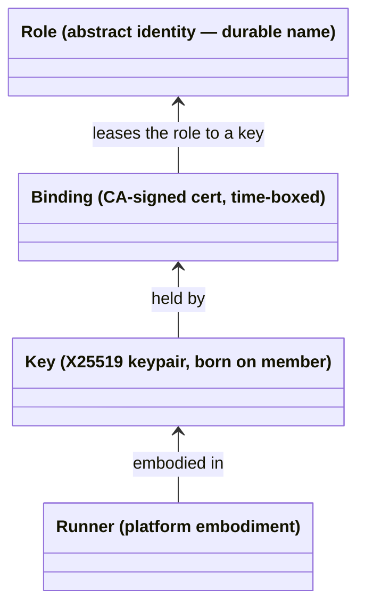
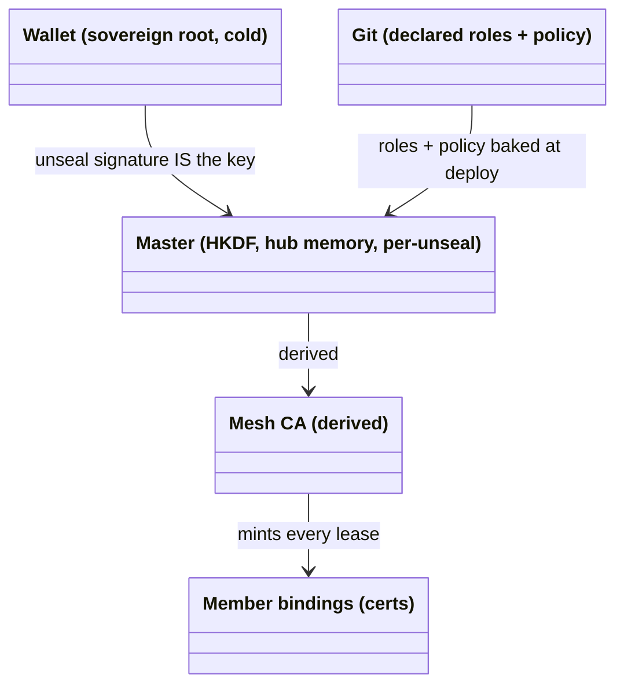
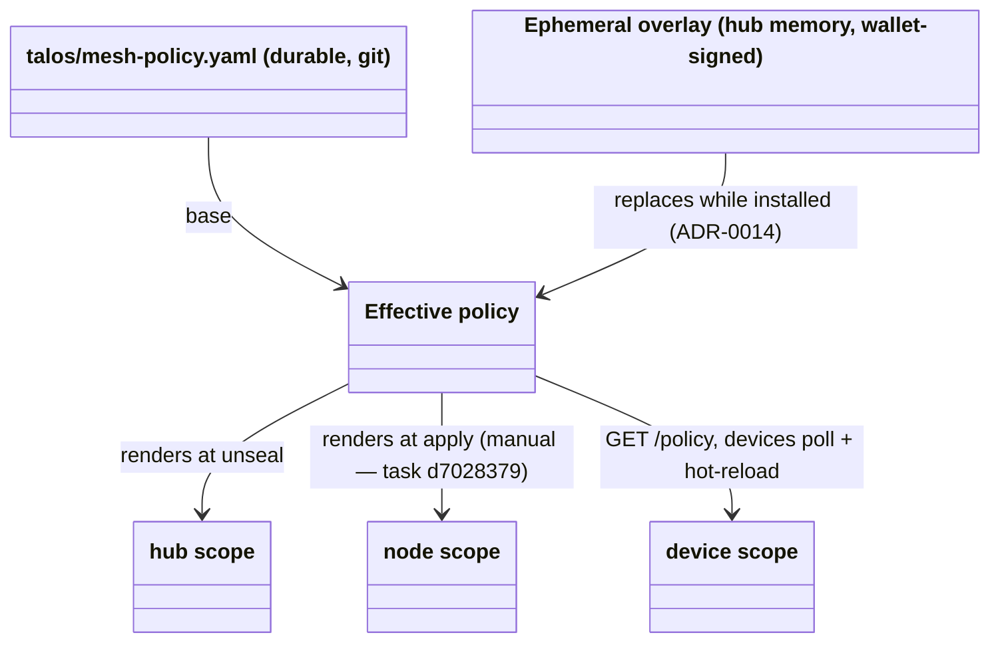
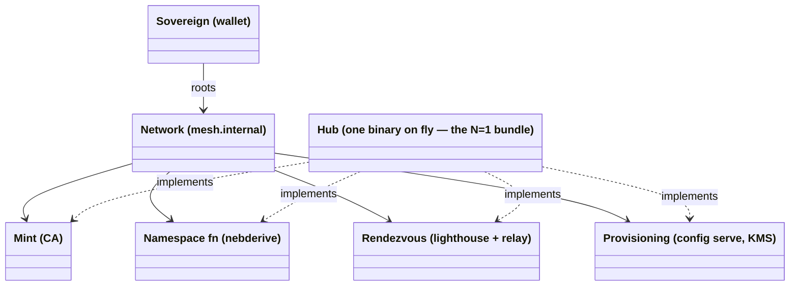
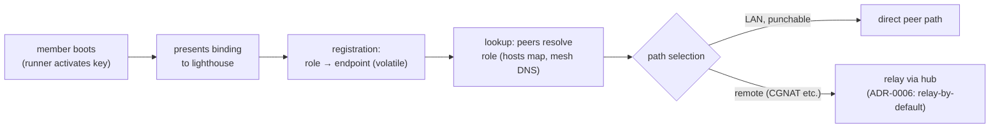

# Domain Model

<!-- High-level entities and how they relate. Conceptual, not an ERD —
     no attributes, no cardinality, no FKs. Nouns and relationships,
     Mermaid diagrams, glossary. Exempt from the desired-state line
     budget: as expressive as the domain requires; pruned for
     accuracy and drift, never for length. -->

> **Live vs. planned (2026-09-03).** This model is written for the
> *desired* state and is deliberately ahead of the code. What runs
> today: nebula mesh, CA-signed bindings, receiver-side firewall
> compiled from `mesh-policy.yaml` (ADR-0014), SIWE→OIDC app sessions
> (ADR-0010). **Planned, not built:** everything marked ADR-0016 /
> ADR-0017 or `359.*` — iroh transport, grants, facets, consent
> grants, `authorize()`, the name map. The §1–§4 structure and the
> "three layers" vocabulary apply to both; the glossary says per term
> which side it is on.

What this system models, in one sentence: **decentralized,
client-owned identity under wallet-rooted authority, organized into
networks a sovereign offers and members consent to, with peer-to-peer
data paths and per-network central services.** Four concepts carry
everything: the member stack (§1), authority (§2), the network (§3),
and rendezvous (§4).

The model is written for N networks and N sovereigns; the current
deployment is the **N=1 instance** — one sovereign (the wallet), one
network (`mesh.internal`), one node (the hub) providing all of the
network's services.

### The three layers (read this before the sections)

Pinned 2026-09-03 after a design session that lost time to loose
terms. Everything below sits in one of three layers; keep them apart.

| Layer | What it is | Where in this doc |
|---|---|---|
| **Actor** | the universal unit: has a key, has a wallet, is reachable by knowing only its public key, can send to any other actor. No hierarchy at this layer. Owner, TV, cp1, hub, gateway are all actors. | §1 (key + runner) |
| **Authority** | signed statements by one actor about what another may do: bindings/certs + declared policy. Durable (hours–90 days). | §2 |
| **Negotiation** | how authority changes: an actor proposes a mutation, an actor with the right to grant it signs or not (device flow, machine approval). | §2 admission, §3 |

Vocabulary that follows from this:

- **Sovereign / Owner** is the *root* actor — the one whose key no
  other actor's authority chains above. Do not call members
  "sovereign": a TV's membership is a cert the Owner minted with an
  expiry the Owner set. Members are **delegates** — they own their
  *keys*, not their *authority*.
- **There is no "presence" or "freshness" concept.** A request is
  signed by the requesting actor's key and checked against the
  authority it holds. Permissions that were never delegated (approve
  a machine, mutate policy) are simply requests the *Owner actor
  itself* signs — the wallet prompt is the Owner acting, not a
  liveness check on a device.
- **Two enforcement layers, never merged** (Tailscale/NetBird shape):
  the **network layer** authorizes by binding + policy alone — no
  per-session login, device custody *is* network access for the
  binding's lifetime or until blocklist. The **app layer** keeps user
  sessions on the SIWE→OIDC bridge (ADR-0010). Mesh v3's gateway
  header *complements* SIWE; it does not replace it (`359.9.3`).
- **Verbs are undefined.** Groups exist (`admins`, `media`,
  `machines`); the "what" axis of authorization has no vocabulary yet.
  Spike `talos-config-359.2` owns defining it.

## 1. The member stack: role ← binding ← key ← runner

Every member is four layers, each independently replaceable:

- **Role** — a durable name in a sovereign's namespace: `cp1`, `tv`,
  `marius-laptop`. **Roles never act**; they are what action is
  attributed to. The role owns the address, the DNS labels, and the
  policy predicates that match it. Roles come into being two ways:
  *declared* in git (`talos/machines/<mac>/` — the MAC selects which
  config a box receives, invariant 6) or *ratified* at enrollment
  (the approver-set device name). Addresses derive from the role by
  pure function — `MachineIP(master, MAC)`, `DeviceIP(master, name)`
  — so the namespace is a **stateless registry**: computed, never
  stored, impossible to drift (invariants 1–2).
- **Binding** — the CA-signed cert: a time-boxed lease of a role to a
  key, carrying (name, address, groups), 90-day validity. Membership
  *is* holding an unexpired binding; **revocation is expiry**
  (blocklist-by-fingerprint as the emergency path). Re-keying mints a
  new lease on the same role — nothing moves.
- **Key** — the only thing that acts. Born on the member, never
  travels; the hub mints bindings, never keys (ADR-0012 for devices;
  ADR-0015, Proposed, extends this to machines — until it lands,
  machine keys are still hub-derived via `nebderive.MachineKey`).
  Keys are disposable: identity death at the leaves is normal
  operation; the role is what survives.
- **Runner** — the platform adapter the key lives in: `ext-nebula`
  (Talos allows no agents), the Android app (no root: gomobile +
  VpnService fd + split-DNS shim), `nebup` (stock binary on a
  laptop). All wrap one shared core (`nebderive`, `devkey`,
  enrollment, `policyclient`); convergence owed (task `ea9404af`).

Replaceability is the point: re-key and the role stays; reinstall and
the role stays; swap runner and both stay. A NIC swap changes which
*config* a box selects — a role change, correctly requiring fresh
ratification — not a key event.

## 2. Authority: one sovereign, delegation depth two

Everything reduces to two owner-held keys; servers hold no durable
authority of their own (invariants 1–3).

Authority has exactly two tiers, both rooted at the wallet:

- **Admission** — may this key hold this role: every admission is
  **exactly one wallet signature**, verified by one mint core. Entry
  adapters differ only in the signature's *distance* from the
  enrollment act:

  | Adapter | Signature distance |
  |---|---|
  | nebup | **zero** — signer operates the enrolling device |
  | RFC 8628 / APK | **spatial** — device proposes, approver signs elsewhere |
  | machine boot token (ADR-0015) | **temporal** — the hardware-approval signature, carried forward by a single-use token in the served config |

- **Authorization** — what may this role reach: policy predicates
  (`host:`, `group:`) over binding attributes, enforced at handshake
  and firewall — checked once per connection, not per message. This
  is the *network layer* only; application sessions are a separate
  layer (see "The three layers" above). Under Mesh v3 the same rule
  is evaluated by the gateway/node agent against the NodeId's cert
  chain instead of nebula's firewall (ADR-0016).

### Policy: payload, not identity

_Nebula-era render path, as built. Under ADR-0017 (Proposed) the
effective policy compiles to `invoke` grants that **callers** carry
and receivers verify; the three render sites above become one
(grants fetched on the renewal beat) plus producer-side accept
tables. Redraw when Mesh v3 Phase 1 lands._

Policy names members by role predicates, so syncing rules never moves
bindings, keys or addresses. The three scopes are member *classes* in
the admission table, not kinds of member. Propagation is the
remaining asymmetry: devices self-update (phase 3), nodes need an
`apply` until phase 4 lands (`d7028379`).

## 3. Network: a sovereign's offer, a member's consent

A **network** is the bundle a sovereign roots: a namespace (the
role-set and its derivation function), an admission policy, and
rendezvous services. Hierarchy is not a property of the system —
it is something a sovereign *offers* and members *consent to* by
obtaining bindings. A key could hold bindings in several networks;
sovereigns are many in the model, one in this deployment.

The four services are conceptually separable even though one binary
implements all four — that separation is what keeps the N>1
generalization legible. The hub centralizes **authority-minting and
rendezvous, never traffic** (§4). It is trusted infrastructure, not a
root of trust (invariant 3): killable and fully re-derivable from
(git, wallet) with one unseal. Everything runtime on it is either a
delegation-in-flight or re-derivable; ephemeral state (sessions,
pending enrollments, the policy overlay) dies with the process by
design.

## 4. Rendezvous: registration, lookup, path selection

Discovery holds the system's **only genuinely runtime state**
(role → current endpoint), and that state is volatile by design.

- **Registration** — a member's first act on any network: present the
  binding to the network's lighthouse(s). Nebula's lighthouse
  protocol keeps the mapping fresh internally (location updates ride
  regular traffic — piggybacking for free); the hub never persists it.
- **Lookup** — roles resolve through the mesh zone
  (`*.mesh.internal`): declared roles (machines, hub) always resolve
  from the derived namespace; device roles resolve only while their
  tunnel is live (live-peers-only, ADR-0012); any name scoped under a
  member (`jellyfin.cp1.…`) resolves to that member.
- **Path selection** — the data plane is **peer-to-peer**: direct
  paths on the LAN (a stated goal — LAN traffic never hairpins
  through fly), relay through the hub for remote members, because
  ordinary remote networks are symmetric NATs nothing can punch
  (ADR-0006). The relay forwards envelopes; it is fallback, not
  middleman.

Rendezvous is post-bootstrap by invariant 4: nothing on the
provisioning or recovery path may depend on it.

## Glossary

- **Actor** — the universal unit (see "The three layers"): key +
  wallet + reachable by public key + can send. Owner, members, hub
  and gateway are all actors; hierarchy is an authority-layer fact,
  never an actor-layer one.
- **Sovereign / Owner** — the *root* actor: wallet address
  `0xf568…9406`, proven by offline EIP-191 signature recovery.
  Stateless by construction. (Formerly glossed as "Identity";
  renamed to free the word.) Reserved for the root — members are
  delegates.
- **Delegate** — any actor whose authority chains from another
  actor's signature: every member (TV, laptop, cp1, gateway). Owns
  its key, not its authority.
- **Verb (`can`)** — the action a delegation cert grants, drawn from a
  small closed, versioned set (`member`, `invoke`, `speak-as`,
  `reach-me-at`, `relay`, `publish`; unknown ⇒ reject). The verb
  never carries its object: target and facet live in structured
  caveats (`cav.target`, `cav.facet`) so that chain attenuation is
  field-wise intersection, not string parsing. _(Pinned 2026-09-03,
  spike `359.2`.)_
- **Grant** — a delegation cert with `can: invoke`: the Owner (or any
  grantor) authorizes an `aud` — an actor *or a group name* — to
  reach `cav.target` on `cav.facet`. `talos/mesh-policy.yaml` is the
  Owner's *recipe*; the hub compiles it into grants. **The grant is
  the record**: the grantee stores and presents it; the grantor keeps
  no authoritative state (it may log, never consult). Renewal =
  present the expiring cert, grantor re-verifies its own signature
  and re-issues. Lost grants ⇒ re-negotiate; lost key ⇒ new actor.
  _(Pinned 2026-09-03, spike `359.2`.)_
- **Consent grant** — the explicit first link of every chain: the
  receiver grants `invoke {target: self, facet: *}` to the network's
  Owner (delegable). Today implicit ("the node trusts the CA in the
  config it accepted"); under the protocol it is a real cert the node
  agent holds, so a receiver can honor more than one sovereign and
  the verifier has no special case for "the CA".
- **Facet** — a named entry point an actor exposes, defined and held
  **producer-side** as an accept table `facet → forward target`. Closed
  per receiver kind: node agent `apid`, `kube-api`; gateway
  `ingress-http` (one class for every HTTP UI — per-app authorization
  stays app-layer), `jellyfin` (raw TCP); hub `hub-http`, `relay`.
  Facets are what grants name (`cav.facet`); on the wire a facet is an
  ALPN class (coarse, because ALPN is visible in the ClientHello).
  Ports exist only inside a facet definition (forward) and in the
  device-local map (expose) — never in a grant. Reachability (ICMP
  today) is not a facet: an unauthenticated ping. Services are not
  actors; a service is a facet on some actor (the gateway for
  Kubernetes Services). _(Pinned 2026-09-03, spike `359.2`.)_
- **Name map** — the signed directory members receive on the renewal
  beat. Two halves with different owners: **name → NodeId** is the
  Owner's namespace (authoritative, derived from git, invariant 1);
  **NodeId → {port: facet}** is the producer's advertisement (the
  protocol form is the actor's own `reach-me-at` record; the hub
  compiles it for actors whose config the Owner writes). A dialing
  convenience, never an authorization input. Replaces the mesh DNS
  server under Mesh v3.
- **Cert classes and lifetimes** _(pinned 2026-09-03, spike
  `359.2`)_ — consent grant: bound to the accepted config, re-minted
  at boot/apply, delegable. `member`: 90 d, renewed at ⅔ life by
  background dial, non-delegable. `invoke` group grants: 7 d, polled
  daily and re-fetched on policy-epoch change, non-delegable in v0.
  `reach-me-at`: 1 h, piggybacked. `speak-as` for the Owner: deferred
  — Owner-only actions stay wallet-signed. Rule: **propagation is by
  poll, expiry is runway** — no class expires faster than the sealed-
  hub window it must survive.
- **Attenuation** — a chain link adds caveats, never removes;
  effective authority is field-wise intersection over `target`,
  `facet` and every recognised caveat; an unknown caveat rejects.
  **Group resolution rule:** `aud: group:<g>` is satisfied by a
  `member` cert whose `iss` is the *same key* as the grant's `iss`
  and whose `cav.groups` contains `<g>`. Groups are issuer-scoped
  names, never global, never actors.
- **Authorize (the per-connect check)** _(pinned 2026-09-03, spike
  `359.2`; the function the rapid suite and Quint model target)_ —
  inputs: receiver key `R`, its accept table, its consent grant(s),
  the ALPN, the caller's bundle {`member`, `invoke[]`}. Steps: (1)
  ALPN → facet, unknown ⇒ reject; (2) verify `member` (sig, exp,
  `aud` = the QUIC peer key); (3) for each grant, build the chain
  [consent(R→iss), grant], verify every sig/exp/caveat, intersect,
  require target ∋ R and facet ∋ facet, resolve `aud` (key = member
  key, or group rule), reject if member key blocklisted, else accept
  with identity {key, name, groups} from the *member cert only*; (4)
  no grant matched ⇒ reject. Properties: deterministic and offline;
  receiver-rooted (a chain not beginning with an R-signed cert is
  unverifiable, not denied); monotone under attenuation; fail-closed
  on any unknown. Runs **once per stream**; the gateway bounds stream
  lifetime (≤ 1 h) so expiry has a ceiling. Blocklist stays the plain
  git list in v0 (not a negative cert).
- **Projection** — any centralized "who has access" or "what is
  reachable" view. Built from
  the issuance log or from receivers' observations; strictly a
  reflection, never a data source. A valid cert beats a stale
  projection. Exact enumeration of current access is *not* a query
  this system answers (bound + log only — invariant 1 already says
  the device set is not enumerable).
- **Owner-only permission** — an action no delegate holds (approve a
  machine, mutate policy, unseal): the request is signed by the
  Owner's key itself. Not a "fresh signature" or "presence" check —
  those terms are retired.
- **Gateway** *(Mesh v3, planned)* — the member actor in front of
  cluster services: verifies the caller's cert chain against policy,
  forwards to the Service, injects the verified identity as a header.
  Not a rendezvous point (that is the relay/lighthouse); issues no
  authority of its own.
- **Role** — abstract identity: a durable name in a network's
  namespace. Owns address, DNS labels, policy predicates. Never acts.
- **Binding** — a CA-signed cert leasing a role to a key for a
  bounded time (90 days). Holding one *is* membership. Under the
  protocol this is exactly the `member` cert (`can: member`,
  `cav: {name, groups}`) — one thing, two names; "binding" is the
  mesh-side word.
- **Key** — concrete identity: X25519 keypair born on the member,
  never travels. The only thing that acts.
- **Runner** — the platform embodiment of a key: ext-nebula, Android
  app, nebup.
- **Signature distance** — where/when the admission signature is
  produced relative to the enrollment act: zero (nebup), spatial
  (approver flow), temporal (machine boot token).
- **Network** — a sovereign-rooted bundle: namespace + admission
  policy + rendezvous services. This deployment runs one.
- **Hub** — the single config-server binary on fly.io implementing
  the network's four services (mint, namespace, rendezvous,
  provisioning) plus the `/status` and `/policy` admin pages.
  Trusted infrastructure, not a root of trust; killable and
  re-derivable (one unseal).
- **Unseal** — the wallet signature over the frozen master message
  that (re)creates the hub's HKDF master after each deploy. While
  sealed, derived roles are down; nothing is lost.
- **Enrollment** — wallet-authorized minting of a binding: the member
  submits its own pubkey, the approver (at whatever signature
  distance) ratifies role + group, one signature mints the cert.
- **Group** — a *name for a set of members*, and nothing more: it
  appears in a `member` cert's `cav.groups` and as the `aud` of
  `invoke` grants. It has no semantics of its own — what a group may
  reach is entirely the grants addressed to it. (`admins`, `media`,
  `machines`; today also what nebula firewall rules and per-route
  HTTP gates match on.) _(Redefined 2026-09-03, spike `359.2`.)_
- **Mesh zone** — `*.mesh.internal`, served by the hub: declared
  roles from the derived namespace, device roles while their tunnel
  is live.
- **KMS / disk encryption** — node STATE/EPHEMERAL keys derive from
  the master per (machine, partition); unlock rides WAN HTTPS, never
  the overlay (invariant 4).
- **Workload plane** — Kubernetes on the machines: ArgoCD syncs
  `k8s/` from git; ingress-nginx routes `<svc>.cp1.mesh.internal` on
  :80; SIWE→OIDC bridge gates every exposed service with the wallet.
  Data-plane state is excepted from invariant 2 (Longhorn bookkeeping
  shares its payload's fate).

## Relation to the sovereign-actor sketch

The model deliberately mirrors
[`../sovereign-actor-protocol.md`](../sovereign-actor-protocol.md)
where the shapes agree — client-born keys, revocation-as-expiry,
lighthouse rendezvous, consensual hierarchy — and diverges knowingly
where it doesn't: this system *embraces* the stable-name registry SAP
refuses (made safe by being stateless), checks authority once per
connection rather than per message, and has no economics *yet*.
Members own their keys, not their authority: a single-sovereign
instance of the SAP trust topology.

Decision `talos-config-5w1` (2026-09-03): the protocol is not a
separate project — this repo becomes a monorepo with the protocol at
its center and talos-config as its first consumer. Mesh v3's
membership cert is the protocol's delegation cert (`359.2`); the
protocol's economics (EVM-L2/Base for per-relationship flows, PoW
postage for strangers, no per-message money in v0) live in the
protocol's own desired-state once the sub-scope exists (`k3o`), not
here.
