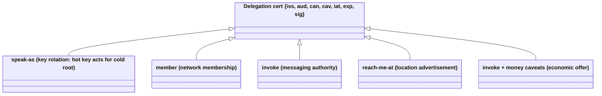
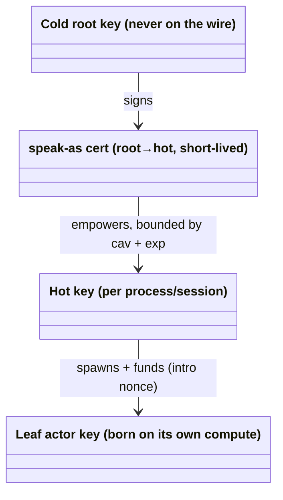
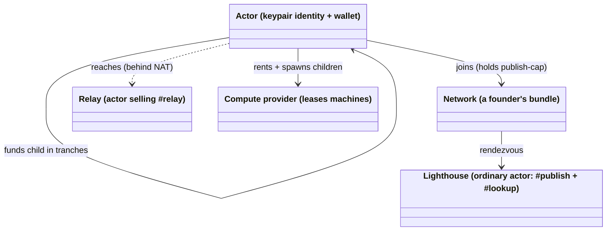

# Domain Model — sovereign-actor protocol

<!-- High-level entities and how they relate. Conceptual, not an ERD.
     Nouns and relationships, Mermaid diagrams, glossary. Exempt from
     the desired-state line budget.

     This is the PROTOCOL's own model: deployment-independent (no
     talos, fly, nebula, Kubernetes). The talos deployment's model —
     the N=1 single-sovereign instance — lives in
     ../../../docs/desired-state/domain-model.md and is authoritative
     for the deployment. Where a term is shared, this file copies the
     root definition verbatim and cites it; it never contradicts it.
     Narrative source: ../sovereign-actor-protocol.md. -->

What this protocol models, in one sentence: **identity names an actor;
every actor is the root of authority over itself; a message is a proof
that the receiver (transitively) invited it.** The model is written for
N sovereigns and N networks; the talos deployment is the N=1 instance
of it.

## The one primitive

Almost everything is a single data structure — a **delegation
certificate**:

```json
{
  "iss": "<granting identity>",
  "aud": "<receiving identity>",
  "can": "<verb: member | invoke | speak-as | reach-me-at | relay | publish>",
  "cav": { "target": "<actor>", "facet": "<class>", "...": "rate limits, spending caps, postage, delegable" },
  "iat": "<issuer's clock at signing>",
  "exp": "<expiry>",
  "sig": "<iss's signature over all of the above>"
}
```

- The verb is a **closed, versioned set** and never carries its object;
  target and facet live in structured caveats, so chain attenuation is
  field-wise intersection (ADR-0017).
- `iat` (issuer's clock at signing) participates only in the verifier's
  time low-water mark, never in authority or attenuation (ADR-0019).
- Certs **chain**: a link may re-delegate what it received, adding
  caveats, never removing them. Effective authority is the intersection
  of the chain. `delegable: false` means no link may follow the one
  that carries it.

This one structure is used **five ways**: key rotation, network
membership, messaging authority, location advertisement, and economic
offers.



## Actors and identity

An **actor**'s identity is the address of a keypair (a short hash of
the public key). Reachable by identity, not by machine address. Two
classes, different lifecycles:

- **Long-lived roots** (a human, an organization, a durable service):
  the identity is a **cold root key** that never touches the wire.
  Day-to-day operation uses **hot keys** carrying short-lived
  `speak-as` delegations from the root. Hot-key compromise is a routine
  recovery (root re-signs a new hot key; the stolen one dies at expiry);
  root compromise is **capture** — the one unrecoverable event, offered
  no in-protocol remedy by design.
- **Actor identities** (spawned workers): a single keypair generated on
  the actor's own compute at birth, never delegated further at the
  leaf. Compromise or loss → the parent kills the lease and spawns a
  replacement that mints a *new* identity. Actors are cheap; identity
  death at the leaves is normal operation.



## Messaging: capabilities, not open inboxes

The unit of communication is **invoking a capability**, not "sending to
an address". An envelope carries `{to: P#facet, payload, proof:
[cert-chain], seq, sig}`. The receiver P verifies **offline and in cost
order**: (1) envelope signature; (2) `to.target` is P and `seq` is
fresh; (3) the proof chain, rooted by a consent P itself signed **in
the verb P expects for the operation** (`invoke` for an envelope; the
chain's verb is then the root consent's, uniform along the chain —
ADR-0002) and folded by attenuation, ends in a link whose `aud`
**binds to the envelope's signer** — the signer key itself, a principal
the signer holds a `speak-as` from (`cav.verbs ∋` that verb), or `"*"`
only when the effective caveats carry `postage` (`group:` audiences are
resolved by the deployment layer, never here); (4) nothing expired, no
unknown caveat, `facet` admitted, and the effective `target` names P —
or a principal P *answers for*: one whose live `speak-as` to P's key P
holds in its own configuration, so a grant may name a cold root and
survive its hot key rotating (ADR-0003). _(ADR-0001, built 2026-09-12
as `cert.VerifyChain`; verb-parameterised 2026-09-17, `xwu`;
receiver-held `speak-as` 2026-09-18, `kau`.)_ The
**proof chain is the registry**, carried by
the caller. Attenuated re-delegation is free
and offline — P verifies a chain to an actor it has never heard of.

**Public reachability** is a default, revocable **frontdoor** facet
(`aud: "*"`, postage-caveated): anyone can message anyone, but
unsolicited delivery costs the sender more than it costs the receiver.
Sovereignty lives at admission time.

## Reachability

Location is a **claim**, signed like everything else (`reach-me-at`,
short expiry). Distribution is layered:

1. **Piggybacking (primary):** every message and renewal response
   carries the sender's current location record — the capability graph
   is the routing table.
2. **Lighthouses (fallback + bootstrap):** an ordinary actor exposing
   `#publish` (gated by a membership cap) and `#lookup`. A **network**
   is a bundle `{lighthouse endpoints, lighthouse identity, your
   publish-cap}`; whoever mints the first publish-caps *founded* the
   network — network authority is just an identity issuing certs, the
   CA pattern rebuilt voluntarily, subordinate to the identities that
   join. One identity may hold caps in many networks.

## Spawning

Parent P spawns child C on a compute market: P signs a lease (paying
from its own funds), injecting an `intro = {parent, endpoints, nonce}`.
C boots, generates its keypair (private key born on C's compute, never
travels), and sends its birth message; P matches the **one-time intro
nonce** (the only bearer token in the system) and replies with C's
starter kit (caps to invoke P + initial funding). `spawn` returns a
*promise* — the parent learns the child's identity only when the birth
message arrives. Supervision trees become **funding trees**; the
`#renew` loop is child-initiated, and a missed beat is natural death.

## Economics

The protocol contains **zero economic enforcement**. Money vocabulary
exists only inside opaque caveats. The default pattern is **bounded
exposure through parsimony**: every actor holds its own funds under its
own key; parents fund children in small tranches on the renewal beat;
public ledgers let a parent *watch* a child's address. Blast radius of a
compromise = outstanding tranche × detection lag — an economic bound,
not a cryptographic one. Hard bounds exist only as negotiated contracts
(gas sponsorship, guardian roles, payment channels), never as protocol.
Chain interactions live strictly on the money path and never block
messaging, key rotation, or rendezvous.

## Relationship overview



---

## Glossary

### Shared vocabulary — verbatim from the root scope

The talos deployment scope
([`../../../docs/desired-state/domain-model.md`](../../../docs/desired-state/domain-model.md))
is **authoritative** for these terms; the definitions below are copied
verbatim so the two scopes cannot drift. Deployment-specific examples
in them (a wallet address, `mesh-policy.yaml`, the hub, `apid`,
`jellyfin`) are the **N=1 instantiation** of the protocol concept — read
the protocol-native prose above for the deployment-free reading. The
protocol scope must never contradict these entries.

- **Actor** — the universal unit (see "The three layers"): key +
  wallet + reachable by public key + can send. Owner, members, hub
  and gateway are all actors; hierarchy is an authority-layer fact,
  never an actor-layer one. _(root glossary: Actor)_
- **Sovereign / Owner** — the *root* actor: wallet address
  `0xf568…9406`, proven by offline EIP-191 signature recovery.
  Stateless by construction. (Formerly glossed as "Identity";
  renamed to free the word.) Reserved for the root — members are
  delegates. _(root glossary: Sovereign / Owner; protocol scope: the
  root actor whose key no other actor's authority chains above,
  generalized to N sovereigns.)_
- **Delegate** — any actor whose authority chains from another
  actor's signature: every member (TV, laptop, cp1, gateway). Owns
  its key, not its authority. _(root glossary: Delegate)_
- **Verb (`can`)** — the action a delegation cert grants, drawn from a
  small closed, versioned set (`member`, `invoke`, `speak-as`,
  `reach-me-at`, `relay`, `publish`; unknown ⇒ reject). The verb
  never carries its object: target and facet live in structured
  caveats (`cav.target`, `cav.facet`) so that chain attenuation is
  field-wise intersection, not string parsing. _(root glossary: Verb;
  Pinned 2026-09-03, spike `359.2`; ADR-0017.)_
- **Grant** — a delegation cert with `can: invoke`: the Owner (or any
  grantor) authorizes an `aud` — an actor *or a group name* — to
  reach `cav.target` on `cav.facet`. **The grant is the record**: the
  grantee stores and presents it; the grantor keeps no authoritative
  state (it may log, never consult). Renewal = present the expiring
  cert, grantor re-verifies its own signature and re-issues.
  **Strict:** an *expired* cert does not renew — the holder
  re-negotiates. No grace window. Lost grants ⇒ re-negotiate; lost
  key ⇒ new actor. _(root glossary: Grant; the talos hub compiling
  `mesh-policy.yaml` into grants is that deployment's grantor. Pinned
  2026-09-03, spike `359.2`; ADR-0017.)_
- **Consent grant** — the explicit first link of every chain: the
  receiver grants `invoke {target: self, facet: *}` to the network's
  Owner (delegable). Under the protocol it is a real cert the receiver
  holds, so a receiver can honor more than one sovereign and the
  verifier has no special case for "the CA". _(root glossary: Consent
  grant; ADR-0017.)_
- **Facet** — a named entry point an actor exposes, defined and held
  **producer-side** as an accept table `facet → forward target`.
  Facets are what grants name (`cav.facet`). Two kinds, one cert
  shape. The **actor facet** is the primary form; the **stream facet**
  is the **compatibility mode** that lets an actor stand in front of a
  service that knows nothing of actors (a plain VPN in front of
  Jellyfin). A stream facet is identified by ALPN class at connect —
  coarse, because ALPN is visible in the ClientHello — and the
  connection is the invocation, checked once; an **actor facet**
  (`#renew`, `#publish`, `#frontdoor` …) rides one fixed ALPN class
  and is named by `to.facet` inside the QUIC-encrypted envelope,
  checked per message. The verifier takes `facet` as an input and
  never sees how the caller derived it. Ports exist only inside a
  facet definition (forward) and in the device-local map (expose) —
  never in a grant. Services are not actors; a service is a facet on
  some actor. _(root glossary: Facet; the closed talos set — `apid`,
  `kube-api`, `ingress-http`, `jellyfin`, `hub-http`, `relay` — is
  that deployment's stream facets. The sketch's `P#report` is an actor
  facet. Pinned 2026-09-03, spike `359.2`; stream vs actor facet ruled
  2026-09-12, `0bc.2` grill-design.)_
- **Attenuation** — a chain link adds caveats, never removes;
  effective authority is field-wise intersection over `target`,
  `facet` and every recognised caveat; an unknown caveat rejects.
  **Target wildcard** _(ADR-0004, Accepted 2026-09-19)_: `target:
  ["*"]` is the identity element of the `target` intersection — the
  link does not narrow the target; rule 4 still needs a concrete
  receiver in the effective set (the consent's `self`), so `*` reaches
  exactly the receivers that consented to the chain's sovereign. It is
  the whole set or absent (mixed rejects at decode), and it is for
  grants only: a **consent** whose target is `["*"]` roots no chain
  (rule 1; decision `zeb` a). No other set caveat has a sentinel
  (ADR-0002: absent = ∅).
  **Group resolution rule:** `aud: group:<g>` is satisfied when
  **one sovereign W that R holds a live consent for** both (i)
  vouches for the grant's signer and (ii) vouches for the `member`
  cert's signer — directly (W *is* the signer) or through a live
  `speak-as` whose `cav.verbs` covers the cert's verb and whose
  `cav.groups` covers the groups named — and the member's
  `cav.groups` contains `<g>`. Never "resolved issuers are equal": a
  signer resolves to the *set* of wallets that vouched for it, and
  any wallet can sign a `speak-as` naming any key, so comparing sets
  for overlap lets a stranger wallet bridge two sovereigns' hot keys
  (`authorize.qnt` `invGroupMatchRootedInChain`). Groups are
  sovereign-scoped names, never global, never actors. _(root
  glossary: Attenuation; ruled 2026-09-06, `9l3`.)_
- **Speak-as** — the verb that maps a signer to a principal: *treat
  anything signed by `aud` as if signed by `iss`, within `cav`, until
  `exp`.* Not authority to reach anything. Two axioms: **resolve
  before compare** — every rule that names an issuer operates on the
  resolved issuer, so groups are sovereign-scoped, not hot-key-scoped;
  and **verification-time validity** — a cert's effective expiry is
  `min(own exp, speak-as exp)`. The caller's bundle carries the
  `speak-as` alongside its member cert and grants. _(root glossary:
  Speak-as; pinned 2026-09-06, ADR-0018. This is the protocol's
  cold-root / hot-key split; the talos hub is one long-lived root's
  hot key.)_
- **Time / low-water mark (`lw`)** — time is a trust input with two
  halves. The *upper* bound (denial) is the verifier's local clock:
  ops, not protocol. The *lower* bound (resurrection of expired certs
  under clock rollback) is protocol-enforced: every cert carries
  **`iat`** (issuer's clock at signing), and a verifier keeps
  `lw = max(lw, iat)` over every cert whose signature it verifies **on
  a chain rooted at itself** — never a stranger's self-signed cert,
  which would let any connecting peer push the mark
  (`clock.qnt` `invStrangerNeverAdvances`). Rootedness is
  **signature-only provenance**: the rooting consent's expiry at `now`
  and any speak-as verb/group caveats are irrelevant (decisions `7ry`,
  `jo8`). Update first, then judge with `now = max(local, lw)` —
  across bundles: `Authorize` judges with the caller's `Now`, its
  `Verified` feeds the mark afterwards (`c4c`).
  Uncapped. `lw` is a **safe-to-lose cache**: volatile, optionally
  persisted; loss degrades to the local clock. `iat` never
  participates in authority or attenuation. _(root glossary: Time /
  low-water mark; pinned 2026-09-06, ADR-0019.)_
- **Authorize (the per-connect check)** — the `invoke` instance of
  `VerifyChain` (ADR-0002: a connection is an invocation) plus the
  deployment layer's member/group/blocklist rules. Inputs: the
  receiver's own configuration (key `R`, its consent grant(s), the
  `speak-as` certs it *holds* naming `R` as `aud` — Go `cert.Receiver`),
  its accept table, the ALPN, the caller's bundle {`member`,
  `invoke[]`, `speak-as`}. Resolve the issuer through `speak-as`; the
  resolved `iss` must be one R holds a live consent grant for; for each
  grant build the chain [consent(R→iss), grant], verify every
  sig/exp/caveat, intersect, require target ∋ R **or** target ∋ P for a
  principal P whose live `speak-as P→R` R holds (ADR-0003; never one
  from the caller's bundle) and facet ∋ facet, resolve `aud`, accept
  with identity from the *member cert only*. Properties: deterministic,
  offline, receiver-rooted, monotone under attenuation, fail-closed on
  any unknown; `now` is the effective clock `max(local, lw)`. _(root
  glossary: Authorize; pinned 2026-09-03, spike `359.2`; ADR-0017/18/19;
  target rule widened 2026-09-18, ADR-0003. Model:
  `verification/quint/authorize.qnt`.)_
- **Projection** — any centralized "who has access" or "what is
  reachable" view. Built from the issuance log or from receivers'
  observations; strictly a reflection, never a data source. A valid
  cert beats a stale projection. Exact enumeration of current access
  is *not* a query this system answers. _(root glossary: Projection.)_

### Protocol-native terms (from the sketch)

Terms the protocol defines that have no root-glossary counterpart, or
whose deployment-free form differs from the talos wording. Source:
[`../sovereign-actor-protocol.md`](../sovereign-actor-protocol.md).

- **Identity** — the *address* of a keypair: a short hash of the
  public key. `iss` and `aud` always hold addresses; public keys
  travel alongside signatures when needed.
- **Location record (`reach-me-at`)** — a Cert, not a second record
  type: `{iss: P, aud: "*", can: reach-me-at, cav: {endpoints:
  […]}, iat, exp}`. The lifetime is the issuer's choice, not a rule —
  ADR-0001 sketches ≈ 1 h for a roaming actor; the talos hub, non-roaming
  behind one relay, publishes 7 d. `cav.endpoints` is the verb's object in a
  structured caveat (the same move ADR-0017 made for `target`/`facet`);
  attenuation is intersection, and an **absent set caveat is ∅** —
  `endpoints` included; a constraint's absence is not a permission, so
  a link that wants to permit endpoints enumerates them (protocol
  ADR-0002, ruling `0lo`). Entries are **transport-tagged opaque
  strings** (`iroh:relay=https://…`, `iroh:udp=ip:port`, `mem:<name>`
  for tests); `Transport.Dial(ctx, id, hints)` takes the list and
  ignores tags it does not own — the protocol never parses an address.
  Piggybacking on every Envelope/Reply (`loc?`) **is** the discovery
  layer: iroh runs `PresetMinimal` (no n0 DNS/pkarr), so a moved peer is
  dialable only through a record it or a lighthouse handed you. The
  actor keeps `id → latest valid record` in a volatile cache; an
  incoming `loc` that fails signature or expiry rejects the whole
  envelope (one fail-closed rule). Together with `postage` this is the
  first caveat-vocabulary version bump since ADR-0017. _(Ruled
  2026-09-12, `0bc.2`.)_
- **Renewal beat** — the short recurring cycle (days, not months) on
  which credentials are re-signed. **Per-relationship**: every edge
  renews with its own counterparty. There is no global clock tick.
  **`#renew` is an ordinary actor facet behind an ordinary grant**
  (`{target: grantor, facet: renew}`, part of every starter kit /
  membership bundle, renewing itself through the same loop) — never a
  verifier special case where "any cert I signed" authorizes asking.
  Payload = the certs to renew (batch, one grantor); the grantor checks
  own-signature — `iss` is me, a hot key of mine (my own speak-as), or
  a hot key of a principal *I answer for*: the proof carries a live
  `speak-as P→iss` and I hold a live `speak-as P→me`, both covering the
  cert's verb (rule 4 on the signing side; a cert signed by a dead hub
  key renews at the live one, ADR-0018 `xfx`, built 2026-09-19) —
  unexpired, that the cert's `aud` **binds the invoking
  signer the way rule 3 binds a chain's last link** — `aud == from`, or
  a live `speak-as aud→from` in the proof with `cav.verbs ∋ invoke`
  (`cert.SpeaksFor`; so a cert naming the holder's cold principal
  renews from its hot key — `7ei`, built 2026-09-18) — and re-issues
  **same `aud`, same or narrower `cav`, fresh `iat`/`exp`** — never
  wider; wider is a new negotiation. Reply = per-cert result (new cert
  or refusal). The holder's beat runs at a fraction of the shortest
  lifetime it holds (fraction unchosen). _(Ruled 2026-09-12, `0bc.2`;
  aud binding ruled 2026-09-14, `7ei`.)_
- **Network** — a bundle a founder roots: `{lighthouse endpoints,
  lighthouse identity, your publish-cap}`. Holding a publish-cap is
  what "being in a network" means. One identity, many networks.
- **Lighthouse** — an ordinary actor exposing `#publish` (membership-
  gated) and `#lookup` (per-network policy). The rendezvous point;
  replicated on stable endpoints. The one place stable machine
  addresses matter.
- **Relay** — an actor selling a `#relay` facet; forwards envelopes
  blindly for actors behind NAT. Relay-by-default; direct paths are an
  optimization.
- **Frontdoor** — the default, revocable public-reachability facet an
  actor mints (`aud: "*"`, postage-caveated). The open-world default;
  going dark = not re-minting it (≤ 24 h tail).
- **Postage** — the per-message cost a stranger attaches so unsolicited
  delivery costs the sender more than the receiver. Pluggable: PoW
  placeholder, micropayments the goal. A single-use token bound to the
  envelope hash. As a **caveat** (`cav.postage`, opaque requirement
  string) its presence is monotone along a chain — a link may add it,
  none may remove it; two links naming different requirements taint
  the chain (reject). It is the one caveat whose *addition* can widen
  acceptance: `aud: "*"` without `postage` is **malformed** (rejected),
  with it the chain admits any payer. Invariant 5 ("attenuation only")
  is about authority over named audiences; postage is the
  well-formedness condition of the open audience, not an attenuation.
  _(Ruled 2026-09-12 errata §1; q-nlink OQ1.)_
- **Intro nonce** — the one-time bearer token a parent injects when
  spawning; the child exchanges it immediately for real certs. The
  only bearer token in the system.
- **Lease handle** — the provider's own lease object, distinct from the
  child's `id`: how you kill an actor (vs. how you talk to it). Relies
  on the provider honoring its termination API.
- **Tranche** — the small increment of funding a parent releases to a
  child on the renewal beat; bounds money exposure of a compromised
  child.
- **`seq` (replay high-water mark)** — a per-sender monotonic counter;
  the receiver keeps a volatile high-water mark per correspondent and
  drops replays. Lost on a receiver restart (window bounded by cert
  expiry). The counter must also be monotonic across the **sender's**
  restarts — the receiver's mark outlives them — so a sender seeds
  its first seq to each receiver from its clock (`Actor.SeqBase`,
  opt-in, 2026-09-19); stateless, and a rolled-back clock only denies.
  **Load-bearing, not defence in depth**: the envelope path does not
  bind signer to transport peer, so any observer of a valid envelope
  can resend it over its own connection. _(Ruled 2026-09-12, `0bc.2`.)_
- **Envelope** — the signed unit of actor messaging: `{from, to:
  {target, facet}, seq, payload, proof: [cert…], loc?, sig}`. JCS
  canonical form and scheme-selected signature as for certs; `payload`
  is opaque bytes (hashed, never canonicalized — the protocol does not
  parse payloads); `from` is required because `ed:` signatures do not
  recover the key; `to.target` must equal the receiver (cheap check
  before the chain); `loc` is an optional piggybacked `reach-me-at`
  cert. The envelope is **self-authenticating**: the transport peer
  key is a hint, never an authority input. Verified in cost order:
  `sig`, then `to.target`/`seq`, then the proof chain. _(Ruled
  2026-09-12, `0bc.2`.)_
- **Invocation** — one capability invocation = one bidirectional
  transport stream: request envelope in, at most one Reply back,
  stream closed. Request/reply correlation comes from the stream, not
  from ids or a pending table. Errors are Replies with a status
  payload, never transport-level closes. _(Ruled 2026-09-12, `0bc.2`.)_
- **Reply** — `{re: <hash of the request envelope>, from, payload,
  loc?, sig}`: signed, bound to its request, and **carries no proof
  chain**. `loc?` is the replier's piggybacked `reach-me-at` — the
  renewal response is the one call a moved parent is guaranteed to
  receive from its children.
  The open stream is the authority to reply — the requester invited it
  by asking, and only the requester could have opened that stream, so
  invariant 2 (authority over an actor originates at that actor)
  holds without a cert. Requiring a proof would invert the capability
  direction (every caller holding a grant *from* every callee). The
  requester checks `re` and `from == to.target` of its request. _(Ruled
  2026-09-12, `0bc.2`.)_
- **Stream facet / actor facet** — see **Facet** above: a stream facet
  is identified by ALPN class at connect and the connection is the
  invocation (talos forwarding, no envelope); an actor facet rides one
  fixed ALPN class and is named by `to.facet` in the envelope, checked
  per Invocation. The chain verifier takes `facet` and is
  derivation-blind.
- **Transport** — the protocol's only contract with the wire
  (`actor.Transport`): bind an **Endpoint** for an identity; `Dial(ctx,
  id, hints)` where `hints` are the transport-tagged strings of a
  Location record (a transport ignores tags it does not own and fails
  `ErrUnreachable` with none of its own); `Accept` yields **Streams**
  with the peer's transport identity as a *hint*; `Endpoints()` reports
  the tags it can be reached at. A Stream is one Invocation: the
  request is the whole send side until FIN, the Reply the whole return
  side until FIN — no length prefixes, no multiplexing inside a stream.
  Two implementations, one contract test: in-memory (`mem:<name>`
  tags, tests and in-process hub actors) and iroh (`iroh-transport/`,
  own module; `ed:` actor id **is** the iroh EndpointId, one ALPN
  `sovereign-actor/v1`). `protocol/` never imports a concrete
  transport. _(Built 2026-09-12, `0bc.2.5`/`.6`.)_
- **Mailbox** — the actor's serial, bounded inbound queue. Transport
  goroutines do only the pure cheap rejections (decode, `sig`,
  `to.target == me`) and enqueue; **one** actor goroutine does `seq`,
  chain verification, `Mark.ObserveAll`, the handler and the Reply, so
  handler authors never lock. A full mailbox **drops** (invariant 12:
  at-most-once, sender retries). Depth is an unchosen number
  (`DefaultMailbox = 64` placeholder). _(Built 2026-09-12, `0bc.2.5`.)_
